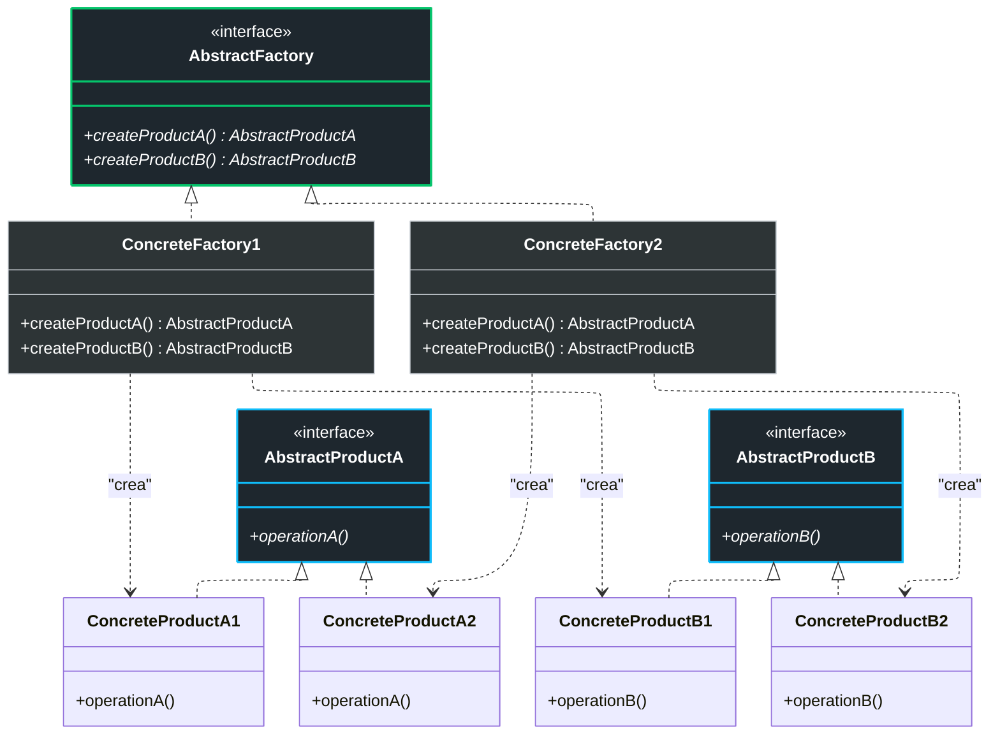
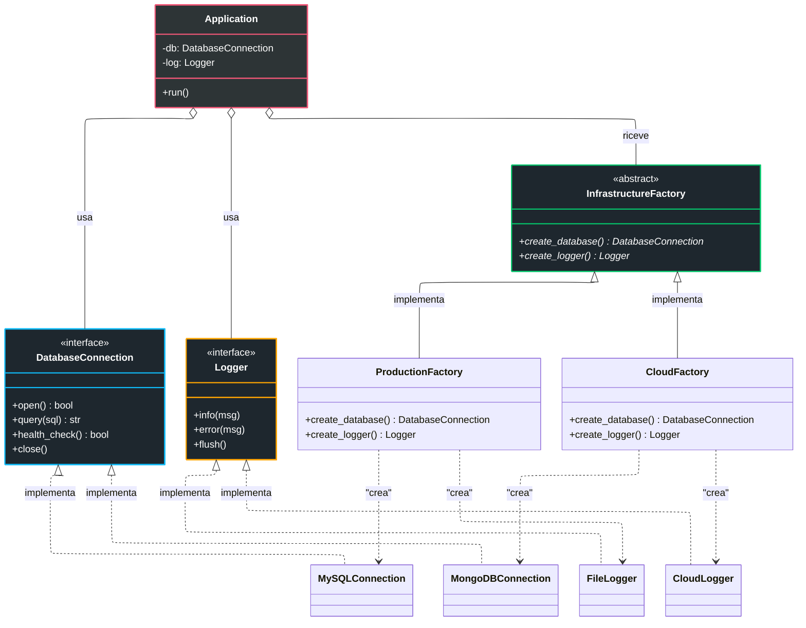
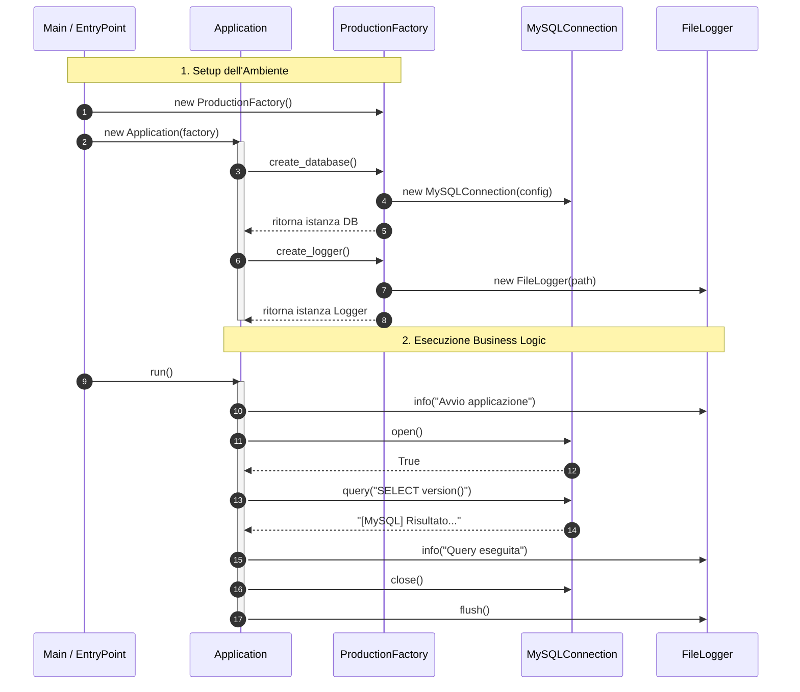

# Abstract Factory Pattern

## Problema

Innanzitutto è importante analizzare questo design pattern solo dopo aver analizzato e capito il Factory Method, perché è un'estensione di quest'ultimo. 
Infatti tale pattern si pone come obiettivo quello di risolvere un problema più complesso, ovvero quando abbiamo più famiglie di prodotti da creare. Nell'esempio del Factory Method, avevamo un solo tipo di classe, simili tra loro: `X`, `Y`, `Z`. Quindi quel che facemmo fu creare un'interfaccia comune `A` e poi una factory per ogni classe concreta, così da usare le factory per creare oggetti di tipo `A` senza conoscere la classe concreta.
Ora invece immaginiamo di avere più famiglie di classi, ad esempio `X1`, `Y1`, `Z1` che appartengono alla famiglia 1, e `X2`, `Y2`, `Z2` che appartengono alla famiglia 2. Il problema è che se usassimo il Factory Method, avremmo bisogno di una factory per ogni classe concreta, quindi 6 factory: `FactoryX1`, `FactoryY1`, `FactoryZ1`, `FactoryX2`, `FactoryY2`, `FactoryZ2`. Questo porterebbe a un numero esponenziale di factory.

Per ritornare all'esempio classico della logistica, immaginiamo di avere sempre i mezzi di trasporto `Camion`, `Nave`, `Aereo`, ma ora abbiamo due famiglie che li dividono ulteriormente: i mezzi elettrici (`CamionElettrico`, `NaveElettrica`, `AereoElettrico`) e i mezzi a combustione (`CamionCombustione`, `NaveCombustione`, `AereoCombustione`). Se usassimo il Factory Method, avremmo bisogno di 6 factory per creare questi mezzi, il che è inefficiente e difficile da mantenere.

N.B.: tipicamente i vari prodotti di una famiglia sono progettati per lavorare insieme, come ad esempio un database con un driver specifico o un logger specifico e così via. 

## Soluzione

La soluzione a questo problema è il pattern **Abstract Factory**. In questo pattern, invece di avere una factory per ogni classe concreta, abbiamo una factory astratta che definisce un'interfaccia per creare famiglie di oggetti correlati. Poi, per ogni famiglia di prodotti, creiamo una factory concreta che implementa questa interfaccia.

Spiegato per fasi abbiamo:
- **Product**: definiamo l'interfaccia del prodotto (es. `A`) con metodi astratti. Le classi concrete (`X1`, `Y1`, `Z1`, `X2`, `Y2`, `Z2`) implementeranno questa interfaccia.
- **Abstract Factory**: definiamo l'interfaccia `AbstractFactory` con metodi astratti per creare OGNI tipo di prodotto, ad esempio `create_X()`, `create_Y()`, `create_Z()`. Le classi concrete (`FactoryFamiglia1`, `FactoryFamiglia2`) implementano questi metodi e restituiscono istanze dei prodotti concreti della rispettiva famiglia.

Di conseguenza quel che succede è che io con ogni factory concreta creo un'intera famiglia di prodotti, e il client può scegliere quale famiglia usare semplicemente istanziando la factory concreta corrispondente.

Come usare l'Abstract Factory

- Nel codice client, invece di istanziare direttamente i prodotti concreti, si istanzia la factory concreta corrispondente alla famiglia di prodotti desiderata (es. `FactoryFamiglia1`) e si chiama i metodi per creare i prodotti (es. `create_X()`, `create_Y()`, `create_Z()`).
- Il client utilizza l'interfaccia dei prodotti senza conoscere la loro implementazione concreta, e può facilmente cambiare la famiglia di prodotti semplicemente cambiando la factory concreta istanziata.

Esempio (logistica)
- Interfaccia comune: `MezzoDiTrasporto` con `carica()` e `scarica()`.
- Classi concrete: `CamionElettrico`, `NaveElettrica`, `AereoElettrico` per la famiglia elettrica, e `CamionCombustione`, `NaveCombustione`, `AereoCombustione` per la famiglia a combustione, tutte implementano `MezzoDiTrasporto`.
- Definiamo l'interfaccia `MezzoDiTrasportoFactory` con metodi `create_Camion()`, `create_Nave()`, `create_Aereo()`.
- Implementazioni concrete: `FactoryElettrica`, `FactoryCombustione`, ciascuna crea i rispettivi mezzi di trasporto della famiglia. 

## Diagrammi

### Diagramma generico

### Diagramma specifico

La cosa migliore è guardare questi diagramma dopo aver visto il codice, altrimenti potrebbe essere un po' difficile da capire. 

### Diagramma di sequenza

### Vantaggi
L'Abstract Factory offre benefici cruciali per la gestione di sistemi complessi:

- **Compatibilità dei Prodotti**: Garantite che i prodotti ottenuti da una factory siano compatibili tra loro, mantenendo la coerenza all'interno della famiglia di oggetti.

- **Disaccoppiamento**: Si evita un accoppiamento stretto tra il codice client e le classi concrete dei prodotti.

- **Single Responsibility Principle**: Potete estrarre il codice di creazione dei prodotti in un unico posto, rendendo il sistema più facile da supportare e manutenere.

- **Open/Closed Principle**: È possibile introdurre nuove varianti (famiglie) di prodotti senza dover modificare il codice client esistente. Tuttavia... vedi contro 

### Svantaggi
Tuttavia, l'astrazione ha un costo:
- **Complessità Elevata**: Il codice può diventare inutilmente complicato a causa dell'introduzione di numerose nuove interfacce e classi.

- **Rigidità dell'Interfaccia**: Se dovete aggiungere un nuovo tipo di prodotto alla famiglia (ad esempio, aggiungere un "Elicottero" alla vostra logistica), dovrete modificare l'interfaccia della Factory Astratta e tutte le sue implementazioni concrete.

- **Difficoltà Iniziale**: Richiede una pianificazione attenta e una conoscenza approfondita dei principi della programmazione orientata agli oggetti.
