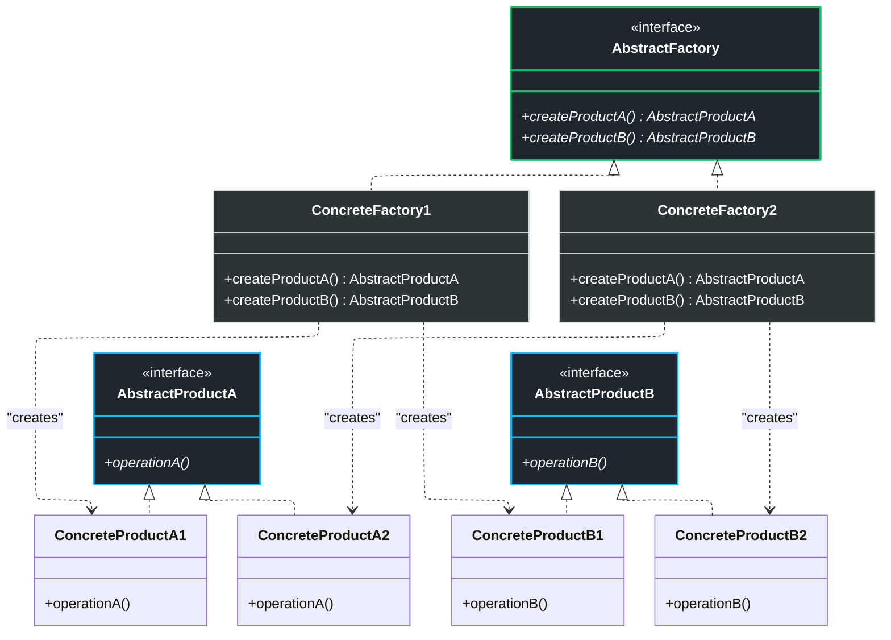
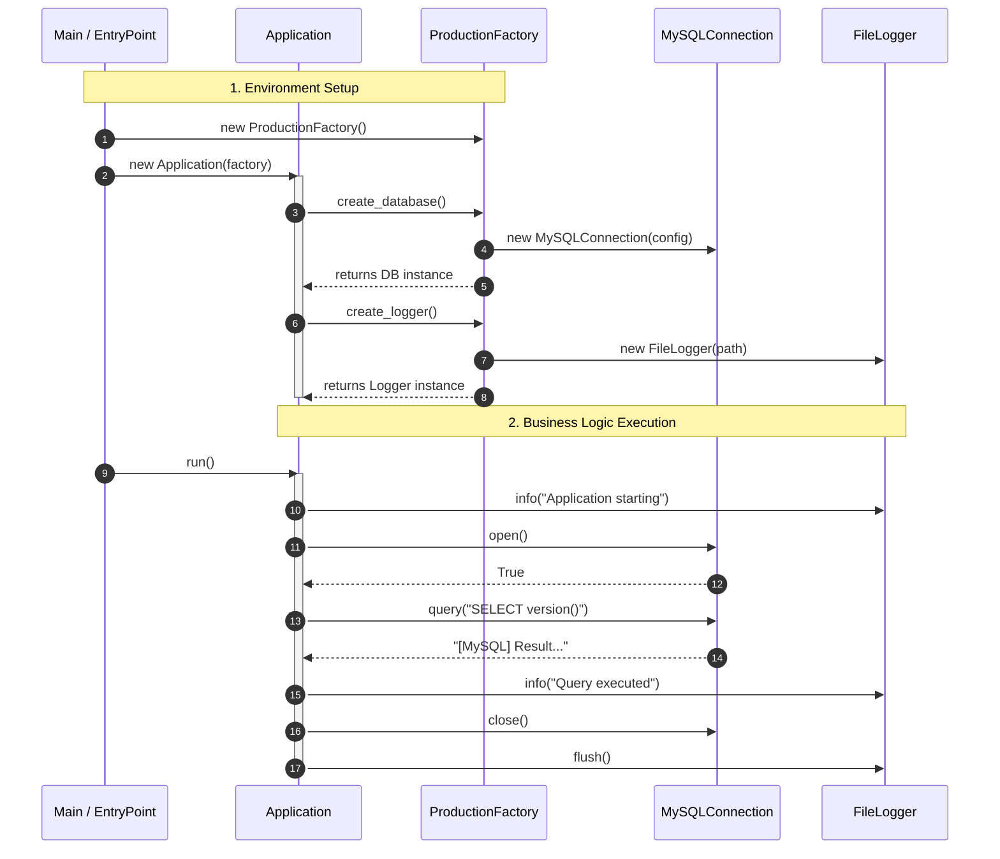

# Abstract Factory Pattern

## Problem

First of all, it's important to analyze this design pattern only after having analyzed and understood the Factory Method, because it's an extension of the latter.
This pattern aims to solve a more complex problem, namely when we have multiple families of products to create. In the Factory Method example, we had a single type of class, similar to each other: `X`, `Y`, `Z`. So what we did was create a common interface `A` and then a factory for each concrete class, so we could use the factories to create objects of type `A` without knowing the concrete class.
Now instead, imagine having multiple families of classes, for example `X1`, `Y1`, `Z1` belonging to family 1, and `X2`, `Y2`, `Z2` belonging to family 2. The problem is that if we used the Factory Method, we'd need a factory for each concrete class, so 6 factories: `FactoryX1`, `FactoryY1`, `FactoryZ1`, `FactoryX2`, `FactoryY2`, `FactoryZ2`. This would lead to an exponential number of factories.

Going back to the classic logistics example, imagine still having the transport vehicles `Truck`, `Ship`, `Airplane`, but now we have two families that further divide them: electric vehicles (`ElectricTruck`, `ElectricShip`, `ElectricAirplane`) and combustion vehicles (`CombustionTruck`, `CombustionShip`, `CombustionAirplane`). If we used the Factory Method, we'd need 6 factories to create these vehicles, which is inefficient and hard to maintain.

N.B.: typically the various products of a family are designed to work together, such as a database with a specific driver or a specific logger, and so on.

## Solution

The solution to this problem is the **Abstract Factory** pattern. In this pattern, instead of having a factory for each concrete class, we have an abstract factory that defines an interface for creating families of related objects. Then, for each product family, we create a concrete factory that implements this interface.

Explained step by step:
- **Product**: we define the product interface (e.g. `A`) with abstract methods. The concrete classes (`X1`, `Y1`, `Z1`, `X2`, `Y2`, `Z2`) will implement this interface.
- **Abstract Factory**: we define the `AbstractFactory` interface with abstract methods to create EVERY type of product, e.g. `create_X()`, `create_Y()`, `create_Z()`. The concrete classes (`FactoryFamily1`, `FactoryFamily2`) implement these methods and return instances of the concrete products of their respective family.

As a result, what happens is that with each concrete factory I create an entire family of products, and the client can choose which family to use by simply instantiating the corresponding concrete factory.

How to use the Abstract Factory

- In the client code, instead of directly instantiating concrete products, you instantiate the concrete factory corresponding to the desired product family (e.g. `FactoryFamily1`) and call the methods to create the products (e.g. `create_X()`, `create_Y()`, `create_Z()`).
- The client uses the product interfaces without knowing their concrete implementation, and can easily change the product family by simply changing the instantiated concrete factory.

Example (logistics)
- Common interface: `TransportVehicle` with `load()` and `unload()`.
- Concrete classes: `ElectricTruck`, `ElectricShip`, `ElectricAirplane` for the electric family, and `CombustionTruck`, `CombustionShip`, `CombustionAirplane` for the combustion family, all implementing `TransportVehicle`.
- We define the `TransportVehicleFactory` interface with methods `create_Truck()`, `create_Ship()`, `create_Airplane()`.
- Concrete implementations: `ElectricFactory`, `CombustionFactory`, each creates the respective transport vehicles of the family. 

## Diagrammi

### Generic diagram

### Specific diagram

The best approach is to look at these diagrams after reviewing the code, otherwise they might be a bit difficult to understand. 

### Sequence diagram

### Advantages
The Abstract Factory offers crucial benefits for managing complex systems:

- **Product Compatibility**: You ensure that products obtained from a factory are compatible with each other, maintaining consistency within the object family.

- **Decoupling**: Tight coupling between client code and concrete product classes is avoided.

- **Single Responsibility Principle**: You can extract product creation code into a single place, making the system easier to support and maintain.

- **Open/Closed Principle**: It's possible to introduce new product variants (families) without modifying existing client code. However... see disadvantages

### Disadvantages
However, abstraction has a cost:
- **High Complexity**: The code can become unnecessarily complicated due to the introduction of numerous new interfaces and classes.

- **Interface Rigidity**: If you need to add a new product type to the family (for example, adding a "Helicopter" to your logistics), you'll need to modify the Abstract Factory interface and all its concrete implementations.

- **Initial Difficulty**: It requires careful planning and thorough knowledge of object-oriented programming principles.
