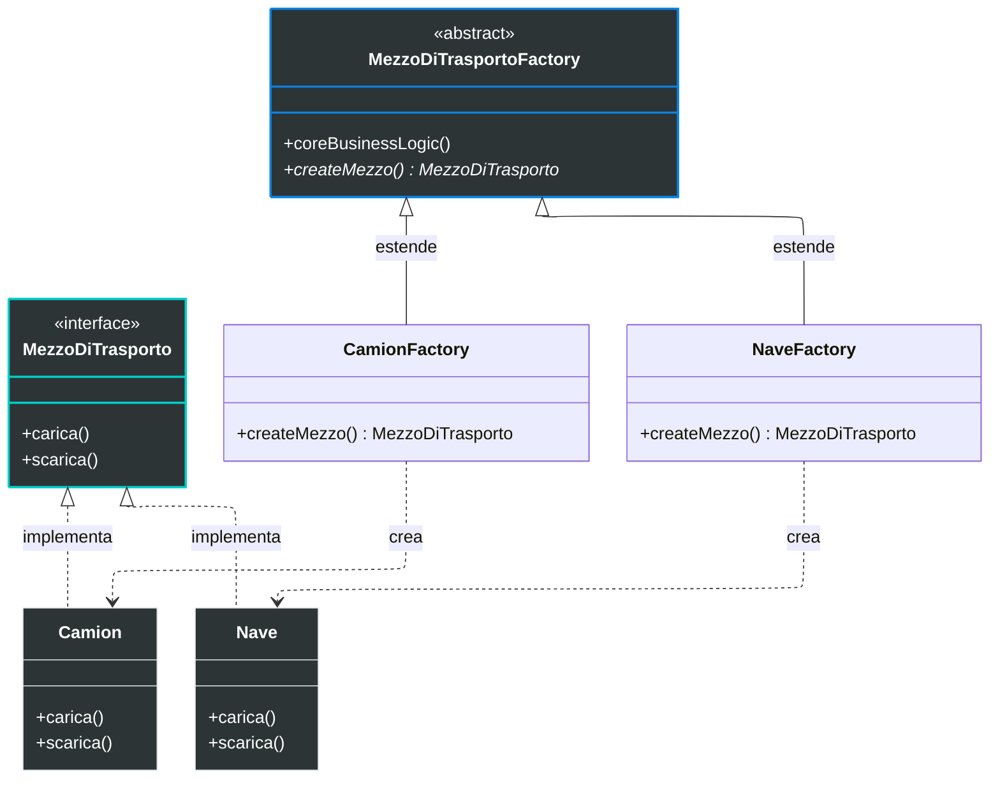
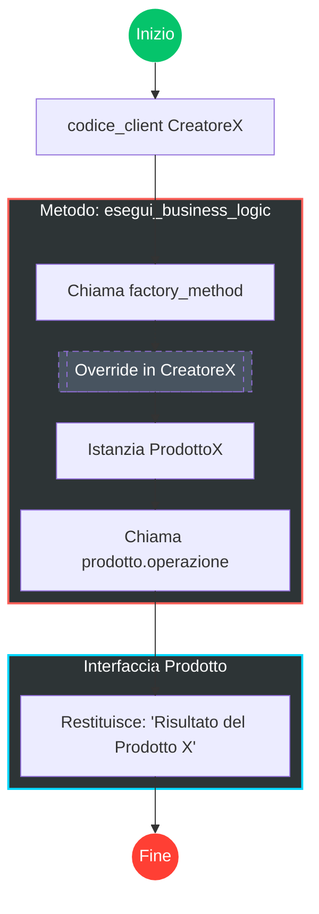

# Factory Pattern

## Problema

Ipotizziamo di trovarci nella situazione in cui abbiamo una classe `X` che faccia determinate operazioni. In seguito però ci rendiamo conto che abbiamo bisogno di più classi che facciano operazioni simili a quelle di `X`, ma con alcune differenze (ad esempio `Y`).

In questo caso potremmo essere tentati di creare un'istanza di `X` o `Y` direttamente nel nostro codice, ma ciò ci costringerebbe a modificare il codice ogni volta che introduciamo una nuova classe. Inoltre, la creazione di istanze in più punti rende il codice più difficile da mantenere e testare.

Con poche classi questo potrebbe andare bene, ma quando il numero di classi cresce e si osserva un pattern ricorrente di comportamento simile, è il momento di introdurre un pattern che gestisca la situazione in modo più efficiente e mantenibile.

Esempio classico: la logistica
- Abbiamo una classe `camion` con metodi `carica()` e `scarica()`.
- L'azienda si espande e servono nuovi sistemi di trasporto, ad es. `nave`, con gli stessi metodi ma comportamenti diversi (acqua vs strada).
- Il codice client dovrebbe creare istanze di `camion` o `nave` a seconda dei casi, aumentando il rischio di errori e la difficoltà di manutenzione.
- Aggiungere un nuovo mezzo (es. `aereo`) richiederebbe modifiche al codice client se non si usa un pattern adeguato.

## Soluzione

La soluzione è il pattern **Factory**. Procediamo per fasi:

- **Product**: definiamo l'interfaccia del prodotto (es. `A`) con metodi astratti. Le classi concrete (`X`, `Y`, `Z`) implementeranno questa interfaccia.
- **Factory / Creator**: definiamo l'interfaccia `Factory` con un metodo astratto `create()`. Le classi concrete (`FactoryX`, `FactoryY`, `FactoryZ`) implementano `create()` e restituiscono istanze dei prodotti concreti.

Importante: il **Creator** non serve solo a creare oggetti; contiene spesso la logica di business core che si appoggia agli oggetti prodotto restituiti dal factory method.

Come usare il Creator

- Nel codice client, invece di istanziare `X`, `Y` o `Z` direttamente, si istanzia la `Factory` concreta corrispondente (es. `FactoryX`) e si chiama `create()` per ottenere un prodotto (tipizzato come l'interfaccia `A`).
- Il client utilizza l'interfaccia del prodotto senza conoscere la sua implementazione concreta.

Esempio (logistica)

- Interfaccia comune: `MezzoDiTrasporto` con `carica()` e `scarica()`.
- Classi concrete: `Camion`, `Nave`, `Aereo` implementano `MezzoDiTrasporto`.
- Definiamo l'interfaccia `MezzoDiTrasportoFactory` con `create()`.
- Implementazioni concrete: `CamionFactory`, `NaveFactory`, `AereoFactory`, ciascuna crea il rispettivo `MezzoDiTrasporto`.

ATTENZIONE: non confondere con lo *Simple Factory* — la `MezzoDiTrasportoFactory` qui è un'interfaccia/creator, non una classe con switch-case che istanzia direttamente diversi prodotti.

N.B.: da nessuna parte c'è bisogno di mettere una lista di classi concrete, perché appunto è tutto perfettamente disaccoppiato. 

##  Diagrammi

### Diagramma delle classi

### Diagramma di esecuzione

La cosa migliore è guardare questo diagramma dopo aver visto il codice, altrimenti potrebbe essere un po' difficile da capire. 

### Vantaggi

L'adozione del Factory Method offre benefici strutturali significativi per la manutenibilità del software:

- **Disaccoppiamento**: evita l'accoppiamento stretto tra la classe che utilizza il prodotto (creatore) e le classi concrete dei prodotti.
- **Single Responsibility Principle**: sposta il codice di creazione in un unico punto del programma, facilitandone la gestione.
- **Open/Closed Principle**: permette di introdurre nuovi prodotti senza modificare il codice client esistente.

### Svantaggi

Nonostante i benefici, ci sono aspetti critici da considerare:

- **Aumento della complessità**: il numero di sottoclassi può aumentare, rendendo il codice più articolato.
- **Rischio di over-engineering**: su progetti molto semplici il pattern può complicare inutilmente l'architettura.

### Quando usarlo?

Dovreste considerare il Factory Method nelle seguenti situazioni:

- **Incertezza sui tipi**: quando non conoscete in anticipo i tipi esatti e le dipendenze degli oggetti.
- **Estensibilità di framework/librerie**: quando volete permettere estensioni tramite ereditarietà.
- **Delega della creazione**: quando la responsabilità della creazione deve essere delegata alle sottoclassi per flessibilità.

