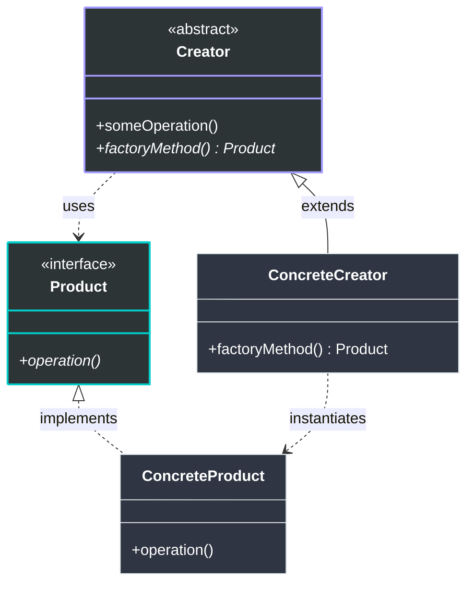
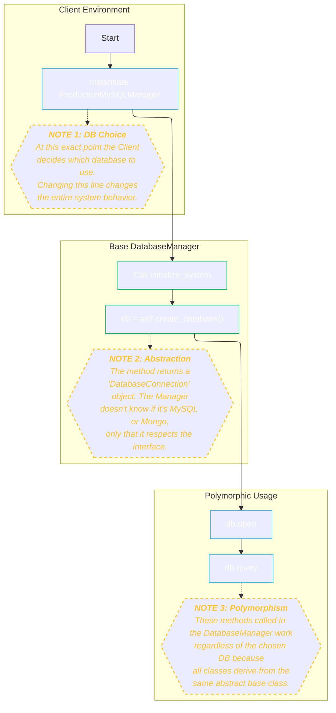

# Factory Pattern

## Problem

Let's say we have a class `X` that performs certain operations. Later, we realize we need more classes that perform operations similar to those of `X`, but with some differences (e.g. `Y`).

In this case we might be tempted to create an instance of `X` or `Y` directly in our code, but this would force us to modify the code every time we introduce a new class. Moreover, creating instances in multiple places makes the code harder to maintain and test.

With a small number of classes this might be fine, but when the number of classes grows and you observe a recurring pattern of similar behavior, it's time to introduce a pattern that handles the situation more efficiently and maintainably.

Classic example: logistics
- We have a `Truck` class with `load()` and `unload()` methods.
- The company expands and needs new transport systems, e.g. `Ship`, with the same methods but different behaviors (water vs road).
- The client code would need to create instances of `Truck` or `Ship` depending on the case, increasing the risk of errors and maintenance difficulty.
- Adding a new vehicle (e.g. `Airplane`) would require changes to the client code if an appropriate pattern is not used.

## Solution

The solution is the **Factory** pattern. Let's proceed step by step:

- **Product**: we define the product interface (e.g. `A`) with abstract methods. The concrete classes (`X`, `Y`, `Z`) will implement this interface.
- **Factory / Creator**: we define the `Factory` interface with an abstract `create()` method. The concrete classes (`FactoryX`, `FactoryY`, `FactoryZ`) implement `create()` and return instances of concrete products.

Important: the **Creator** is not just for creating objects; it often contains core business logic that relies on the product objects returned by the factory method.

How to use the Creator

- In the client code, instead of instantiating `X`, `Y`, or `Z` directly, you instantiate the corresponding concrete `Factory` (e.g. `FactoryX`) and call `create()` to obtain a product (typed as the interface `A`).
- The client uses the product interface without knowing its concrete implementation.

Example (logistics)

- Common interface: `TransportVehicle` with `load()` and `unload()`.
- Concrete classes: `Truck`, `Ship`, `Airplane` implement `TransportVehicle`.
- We define the `TransportVehicleFactory` interface with `create()`.
- Concrete implementations: `TruckFactory`, `ShipFactory`, `AirplaneFactory`, each creates its respective `TransportVehicle`.

WARNING: do not confuse with *Simple Factory* — the `TransportVehicleFactory` here is an interface/creator, not a class with a switch-case that directly instantiates different products.

N.B.: there's no need to maintain a list of concrete classes anywhere, because everything is perfectly decoupled. 

## Diagrammi

### Generic diagram

### Specific diagram

The best approach is to look at these diagrams after reviewing the code, otherwise they might be a bit difficult to understand. 

### Sequence diagram

### Advantages

Adopting the Factory Method offers significant structural benefits for software maintainability:

- **Decoupling**: avoids tight coupling between the class that uses the product (creator) and the concrete product classes.
- **Single Responsibility Principle**: moves creation code to a single point in the program, making it easier to manage.
- **Open/Closed Principle**: allows introducing new products without modifying existing client code.

### Svantaggi

Nonostante i benefici, ci sono aspetti critici da considerare:

- **Aumento della complessità**: il numero di sottoclassi può aumentare, rendendo il codice più articolato.
- **Rischio di over-engineering**: su progetti molto semplici il pattern può complicare inutilmente l'architettura.

