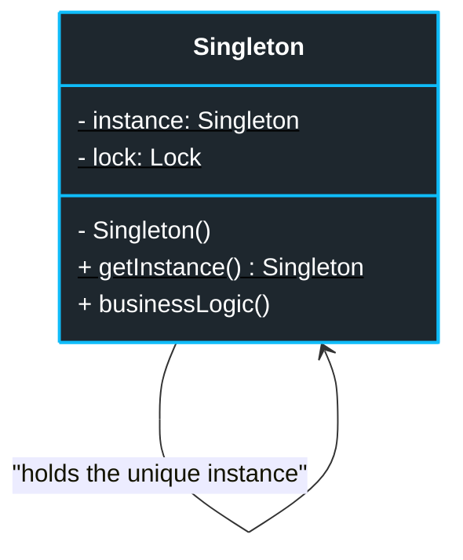
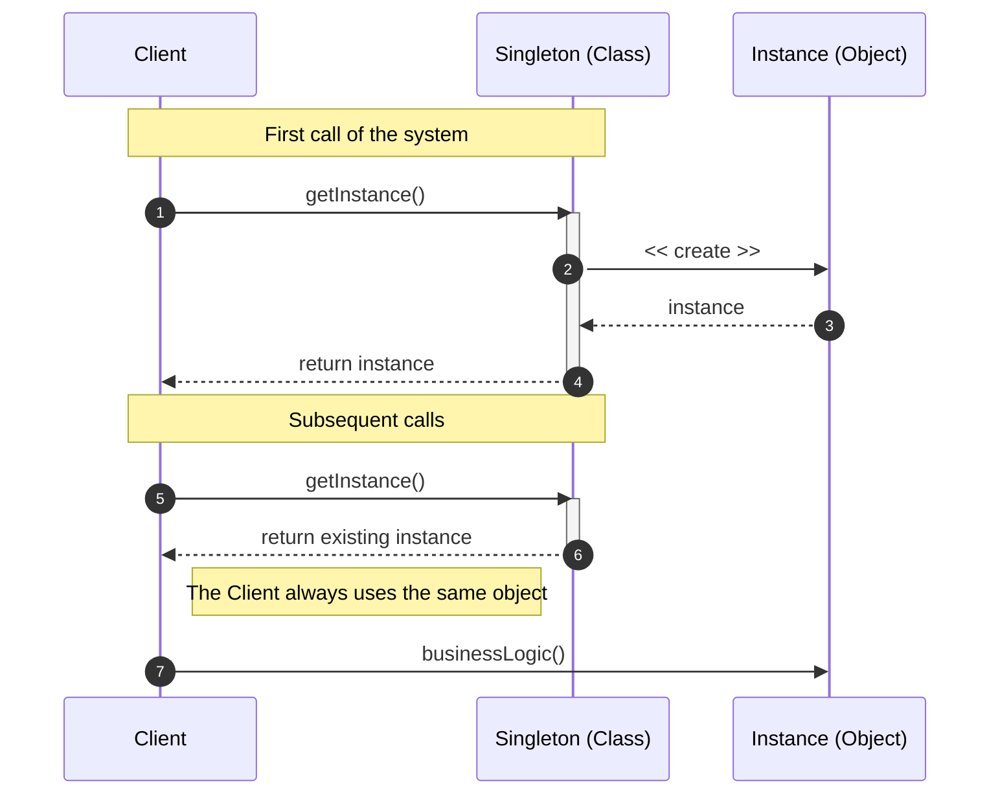
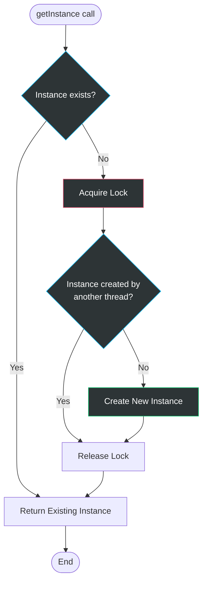

# Singleton Pattern

## Problem

Let's suppose we want to perform a particular operation that requires creating something — not just any generic thing, but something specific that (for one reason or another) must be unique within our system.
If we create a normal class, by definition, every time we call its constructor we get a new instance. Since it doesn't meet our uniqueness requirement, we would end up with multiple instances of that class, which could lead to undesired or inconsistent behavior.

To clarify, scenarios where singletons can be useful are those where:
- We need a global access point to a shared resource. E.g. a database connection, a logger, a configuration; obviously we don't want multiple connections or multiple loggers, but a single one used by the entire system.
- We want to guarantee that there is only one instance of a class for consistency reasons or to avoid conflicts. E.g. a configuration manager, a session manager, a cache manager; in these cases, having multiple instances could lead to inconsistent data or unpredictable behavior.

## Solution

The solution is the **Singleton** pattern. Let's proceed step by step:
- **Singleton Class**: we define a class that has a private static attribute (e.g. `_instance`) that will hold the ONLY instance of the class.
- **Private Constructor**: we make the class constructor private (or protected) so that it cannot be called directly from outside.
- **Public Access Method**: we define a public static method (e.g. `get_instance()`) that checks if the instance already exists. If it doesn't exist, it creates it (with the constructor); otherwise, it returns the existing one.

## Diagrams

### Generic Diagram

### Sequence Diagram

### Flow Diagram (for the instance creation logic)

The double check (double-checked locking) is a common technique to ensure that the instance is created only once, even in multithreaded environments. The first check happens without locking, to avoid unnecessary overhead after the instance has been created. The second check happens inside the lock, to ensure that another thread hasn't already created the instance in the meantime.

### Advantages

Adopting the Singleton offers clear structural benefits when instance consistency is the absolute priority:

- **Uniqueness Guarantee**: you have the certainty that the class has only one instance, eliminating the risk of conflicts between multiple objects managing the same resource.
- **Controlled Global Access**: provides a single rigorous access point. Unlike common global variables, the Singleton protects the instance by preventing other code from accidentally overwriting it.
- **Lazy Initialization**: the object is created only when requested for the first time, saving initial system resources.
- **Future Flexibility**: if in the future you decide to manage multiple instances (e.g. two connection pools), you'll only modify the `getInstance()` method without touching the rest of the code.

### Disadvantages

Many modern developers consider the Singleton an "anti-pattern" due to several critical issues:

- **Violation of the Single Responsibility Principle (SRP)**: the pattern solves two problems simultaneously: it manages the lifecycle (creation and uniqueness) and performs business tasks (e.g. querying a database).
- **Tight Coupling**: it can mask a bad design where components know "too much" about each other, creating hidden dependencies that make the system rigid.
- **Multithreading Complexity**: in concurrent environments, it's necessary to implement locking logic (thread-lock) to prevent two threads from accidentally creating two separate instances at the same moment.
- **Obstacle to Unit Testing**: it's very difficult to isolate code that uses a Singleton. Since the constructor is private, many testing frameworks can't create "mocks" (fake objects) to simulate the class's behavior.

