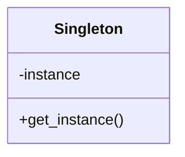

# Singleton Pattern

## 🎯 Problema

_Da completare_

## ✅ Soluzione

_Da completare_

## 📊 Diagramma

```mermaid
%% Diagramma da completare
classDiagram
    class Singleton {
        -instance
        +get_instance()
    }
```

## 🌍 Analogia Reale

_Da completare_

## 🔗 Vedi Anche

- [Pattern Creazionali](../)
- Factory
