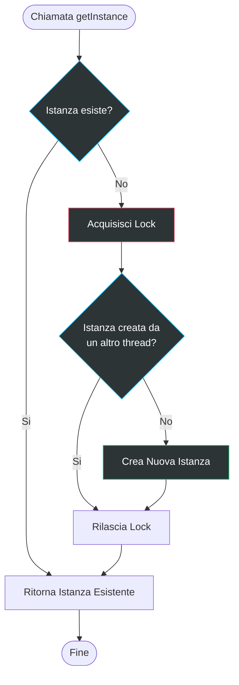

# Singleton Pattern

## Problema

Ipotizziamo di voler fare un'operazione particolare, la quale richiedere la creazione di un qualcosa, ma non un qualcosa generico, bensì un qualcosa di specifico, che (per un motivo o per un altro) deve essere unico all'interno del nostro sistema.
Se creiamo una classe normale, per definizione, ogni volta che chiamiamo il suo costruttore, otteniamo una nuova istanza. Non rispecchiando la nostra esigenza di unicità, ci ritroveremmo con più istanze di quella classe, cosa che potrebbe portare a comportamenti indesiderati o incoerenti.

Per chiarire, i casi in cui possono servire singleton sono quelli in cui:
- Abbiamo bisogno di un punto di accesso globale a una risorsa condivisa. Es. una connessione al database, un logger, una configurazione; ovviamente non vogliamo più connessioni o più logger, ma uno solo che venga usato da tutto il sistema.
- Vogliamo garantire che ci sia solo un'istanza di una classe per motivi di coerenza o per evitare conflitti. Es. un gestore di configurazione, un gestore di sessione, un gestore di cache; in questi casi, avere più istanze potrebbe portare a dati incoerenti o a comportamenti imprevedibili. 

## Soluzione

La soluzione è il pattern **Singleton**. Procediamo per fasi:
- **Classe Singleton**: definiamo una classe che ha un attributo privato statico (es. `_instance`) che conterrà l'UNICA istanza della classe. 
- **Costruttore privato**: rendiamo il costruttore della classe privato (o protetto) in modo che non possa essere chiamato direttamente dall'esterno. 
- **Metodo di accesso pubblico**: definiamo un metodo pubblico statico (es. `get_instance()`) che controlla se l'istanza esiste già. Se non esiste, la crea (con il costruttore); altrimenti, restituisce quella esistente.

## Diagrammi
 
### Diagramma delle classi

### Diagramma di sequenza 

### Diagramma di flusso (per la logica di creazione dell'istanza)

Il duplice controllo (double-checked locking) è una tecnica comune per garantire che l'istanza venga creata solo una volta, anche in ambienti multithread. Il primo controllo avviene senza bloccare, per evitare overhead inutili dopo che l'istanza è stata creata. Il secondo controllo avviene all'interno del blocco, per garantire che un altro thread non abbia già creato l'istanza nel frattempo.

### Vantaggi

L'adozione del Singleton offre benefici strutturali evidenti quando la coerenza dell'istanza è la priorità assoluta:

- **Garanzia di unicità**: hai la certezza che la classe abbia una sola istanza, eliminando il rischio di conflitti tra più oggetti che gestiscono la stessa risorsa.
- **Accesso globale controllato**: fornisce un unico punto di accesso rigoroso. A differenza delle variabili globali comuni, il Singleton protegge l'istanza impedendo che altro codice la sovrascriva accidentalmente.
- **Inizializzazione lazy (pigra)**: l'oggetto viene creato solo quando richiesto per la prima volta, risparmiando risorse di sistema iniziali.
- **Flessibilità futura**: se in futuro decidessi di gestire multiple istanze (es. due pool di connessioni), modificherai solo il metodo `getInstance()` senza toccare il resto del codice.

### Svantaggi

Molti sviluppatori moderni considerano il Singleton un "anti-pattern" a causa di diverse criticità:

- **Violazione del Single Responsibility Principle (SRP)**: il pattern risolve due problemi contemporaneamente: gestisce il ciclo di vita (creazione e unicità) e svolge i compiti di business (es. interrogare un database).
- **Accoppiamento stretto**: può mascherare un cattivo design dove i componenti sanno "troppo" l'uno dell'altro, creando dipendenze nascoste che rendono il sistema rigido.
- **Complessità nel multithreading**: in ambienti concorrenti, è necessario implementare logiche di blocco (thread-lock) per evitare che due thread creino accidentalmente due istanze separate nello stesso istante.
- **Ostacolo ai test unitari**: è molto difficile isolare il codice che usa un Singleton. Poiché il costruttore è privato, molti framework di testing non riescono a creare "mock" (oggetti finti) per simulare il comportamento della classe.

### Quando usarlo?

La regola d'oro è: usalo solo quando il controllo dell'unicità è più importante della facilità di test.

- **Risorse condivise critiche**: quando una classe deve gestire una risorsa hardware o software che non supporta accessi multipli disordinati (es. database, file system, configurazione globale).
- **Sostituto superiore alle variabili globali**: quando hai bisogno di variabili globali ma vuoi impedire che chiunque le modifichi liberamente, garantendo che solo la classe gestisca l'istanza.
- **Integrazione con altri pattern**: le classi Facade, Abstract Factory o Builder spesso vengono implementate come Singleton perché una sola istanza è solitamente sufficiente.

