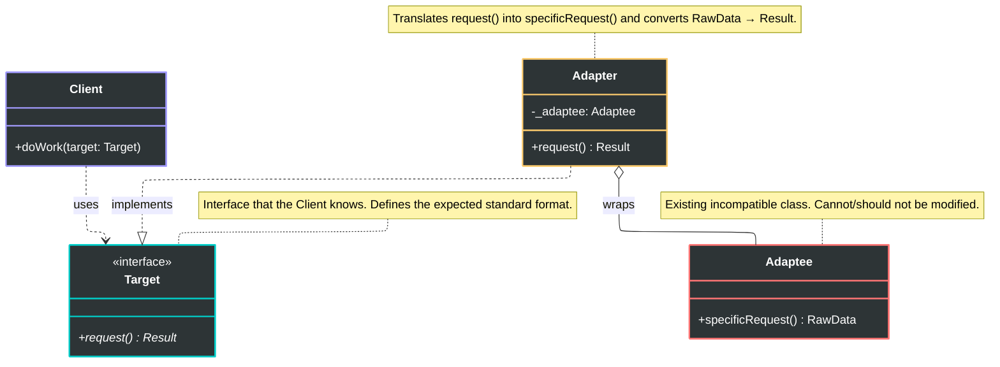
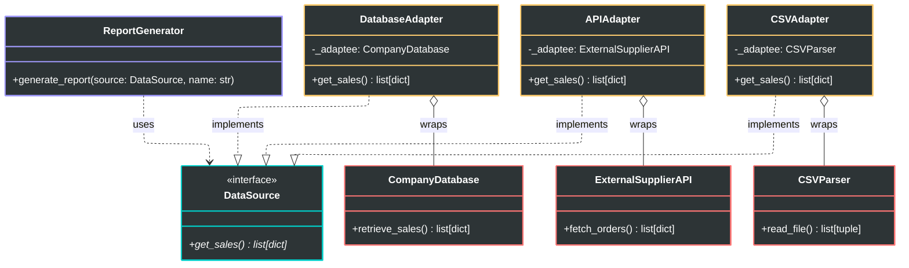
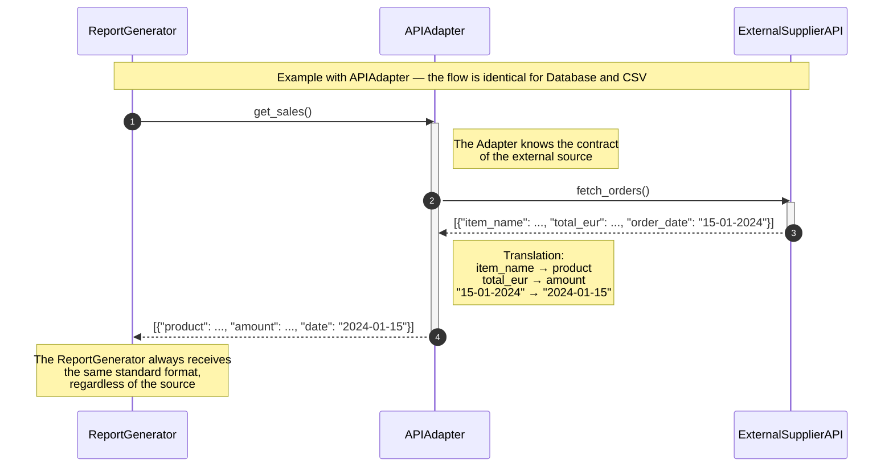

# Adapter Pattern

## Problem

Let's suppose we have a class `X` that performs certain operations (e.g. printing data) receiving input from a class `Y`. In a direct approach, `X` handles exactly the data format of `Y`: convenient as long as we have control over both classes and there are no future changes.

Realistically though, changes arrive: if `Y` changes its format, we need to modify `X` to handle `Y`'s new format. But especially if we wanted to make `X` compatible with an additional class `Z`, we'd have to add more logic to `X` (with `if` or `switch` chains), making the code hard to maintain, inflexible, and at high risk of bugs.

Real-world analogy: a type A (American) electrical outlet only accepts type A plugs. To use a device with a type B (European) plug we can't modify either the outlet or the plug — we need an adapter.

## Solution

The solution is the **Adapter** pattern. The three actors are:

- **Target**: the interface that the client knows and expects (e.g. the type A outlet). Contains the generic operations we want to perform.
- **Adaptee**: the existing class with an incompatible interface (e.g. the type B plug). It can be legacy code or an external library over which we have no control.
- **Adapter**: the intermediate class that **implements** the `Target` interface and **contains** an instance of `Adaptee`. It translates the generic `Target` calls into specific `Adaptee` calls.

The client uses the `Adapter` as if it were a normal `Target`: the adaptation is completely transparent.

To implement this solution:
- **Target**: define the interface with the generic operations we need.
- **Adaptee**: the class with specific operations incompatible with `Target`.
- **Adapter**: implements `Target` and contains an instance of `Adaptee`, translating generic operations into specific ones.

Then the client instantiates an `Adapter`, passing an instance of `Adaptee`, and uses it as if it were a normal `Target`.

## Diagrams

### Generic Diagram

### Specific Diagram

### Sequence Diagram

### Advantages

- **Single Responsibility Principle (SRP):**
One of the main advantages is separation of concerns. The code responsible for data or interface conversion is isolated within the Adapter. The system's business logic stays clean and isn't "polluted" by the technical details needed to make an external library or legacy system work.
- **Open/Closed Principle (OCP):**
It's possible to introduce new types of Adapters into the system without modifying existing client code. As long as the new Adapter implements the `Target` interface the client expects, everything will work correctly. This makes the system extremely **extensible**.
- **Reuse of Incompatible Code:**
The Adapter is the "time machine" of software. It allows using classes written years ago (legacy) or third-party libraries whose source code cannot be modified, making them compatible.
- **Flexibility and Decoupling:**
The client knows nothing about the concrete class providing the service (the Adaptee). It only knows the Target interface. This means that, in the future, you can entirely replace the underlying library by simply creating a new Adapter, without the rest of the application noticing.

### Disadvantages

- **Increase in Overall Complexity:**
Introducing an Adapter means adding new classes and interfaces to the project. This is the classic case of "over-engineering".
- **Performance Overhead (Minimal, but existing):**
Every time the client calls an Adapter method, a "delegation" occurs (the Adapter calls the Adaptee). This adds a small extra step in the call stack. In the vast majority of applications this delay is imperceptible, but in extreme *real-time* or ultra-high-performance systems, every layer of abstraction counts.
- **Debugging Difficulty:**
When an error occurs, the program flow traverses multiple layers (Client -> Adapter -> Adaptee). Following the data path during debugging can become more frustrating, especially if there are complex data conversions in between.
- **Risk of "Dead Code" or Redundancy:**
Sometimes it's simpler and cleaner to directly modify the original class (if we have control over it) rather than building an Adapter. If you start creating Adapters for classes you could easily refactor, you're just adding bureaucracy to your code.
