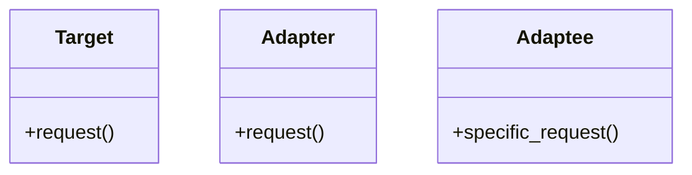

# Adapter Pattern

## Problema

Ipotizziamo di avere una classe `X` che esegue determinate operazioni (es. la stampa di dati) ricevendo input da una classe `Y`. In un approccio diretto, `X` gestisce esattamente il formato dei dati di `Y`: comodo finché si ha il controllo su entrambe le classi e non ci sono cambiamenti futuri.

Realisticamente però i cambiamenti arrivano: se `Y` cambia il proprio formato, bisogna modificare `X`, per fare in modo che possa gestire il nuovo formato di `Y`. Ma soprattutto se volessimo rendere `X` compatibile con un'ulteriore classe `Z`, dovremmo aggiungere ancora logica a `X` (con catene di `if` o `switch`), rendendo il codice difficile da mantenere, poco flessibile e ad alto rischio di bug.

Analogia reale: una presa elettrica di tipo A (americana) accetta solo spine di tipo A. Per usare un dispositivo con spina di tipo B (europea) non possiamo modificare né la presa né la spina — serve un adattatore.

## ✅ Soluzione

La soluzione è il pattern **Adapter**. I tre attori sono:

- **Target**: l'interfaccia che il client conosce e si aspetta (es. la presa di tipo A). Contiene le operazioni generiche che vogliamo eseguire.
- **Adaptee**: la classe esistente con un'interfaccia incompatibile (es. la spina di tipo B). Può essere codice legacy o una libreria esterna su cui non abbiamo controllo.
- **Adapter**: la classe intermedia che **implementa** l'interfaccia `Target` e **contiene** un'istanza di `Adaptee`. Traduce le chiamate generiche del `Target` in chiamate specifiche dell'`Adaptee`.

Il client usa l'`Adapter` come se fosse un normale `Target`: l'adattamento è completamente trasparente.

Per implementare questa soluzione:
- **Target**: definire l'interfaccia con le operazioni generiche che ci servono.
- **Adaptee**: la classe con le operazioni specifiche incompatibili con `Target`.
- **Adapter**: implementa `Target` e contiene un'istanza di `Adaptee`, traducendo le operazioni generiche in operazioni specifiche.

Dopodiché il client istanzia un `Adapter`, passando un'istanza di `Adaptee`, e lo usa come se fosse un `Target` normale.

## 📊 Diagramma

---

## I Vantaggi 

1. **Principio di Singola Responsabilità (SRP):**
Uno dei vantaggi principali è la separazione degli interessi. Il codice che si occupa della conversione dei dati o dell'interfaccia è isolato all'interno dell'Adapter. La logica di business del sistema rimane pulita e non viene "inquinata" dai dettagli tecnici necessari per far funzionare una libreria esterna o un sistema legacy.
2. **Principio Aperto/Chiuso (OCP):**
E' possibile introdurre nuovi tipi di Adapter nel sistema senza modificare il codice client esistente. Finché il nuovo Adapter implementa l'interfaccia `Target` che il client si aspetta, tutto funzionerà correttamente. Questo rende il sistema estremamente **estensibile**.
3. **Riutilizzo di Codice Incompatibile:**
L'Adapter è la "macchina del tempo" del software. Permette di utilizzare classi scritte anni fa (legacy) o librerie di terze parti i cui sorgenti non sono modificabili, rendendole compatibili.
4. **Flessibilità e Disaccoppiamento:**
Il client non sa nulla della classe concreta che sta fornendo il servizio (l'Adaptee). Conosce solo l'interfaccia Target. Questo significa che, in futuro, si può cambiare interamente la libreria sottostante semplicemente creando un nuovo Adapter, senza che il resto dell'applicazione se ne accorga.

---

## Gli Svantaggi

1. **Aumento della Complessità Complessiva:**
L'introduzione di un Adapter significa aggiungere nuove classi e interfacce al progetto. È il classico caso di "over-engineering".
2. **Overhead Prestazionale (Minimo, ma esistente):**
Ogni volta che il client chiama un metodo dell'Adapter, avviene una "delega" (l'Adapter chiama l'Adaptee). Questo aggiunge un piccolo passaggio extra nello stack delle chiamate. Nella stragrande maggioranza delle applicazioni questo ritardo è impercettibile, ma in sistemi *real-time* estremi o ad altissime prestazioni, ogni livello di astrazione conta.
3. **Difficoltà nel Debugging:**
Quando si verifica un errore, il flusso del programma attraversa più livelli (Client -> Adapter -> Adaptee). Seguire il percorso dei dati durante il debugging può diventare più frustrante, specialmente se ci sono conversioni di dati complesse nel mezzo.
4. **Rischio di "Codice Morto" o Ridondante:**
A volte è più semplice e pulito modificare direttamente la classe originale (se ne abbiamo il controllo) piuttosto che costruire un Adapter. Se iniziate a creare Adapter per classi che potreste facilmente rifattorizzare, state solo aggiungendo burocrazia al vostro codice.

---
