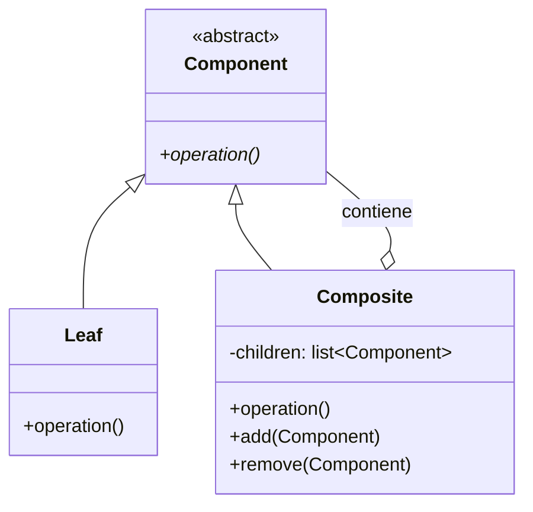
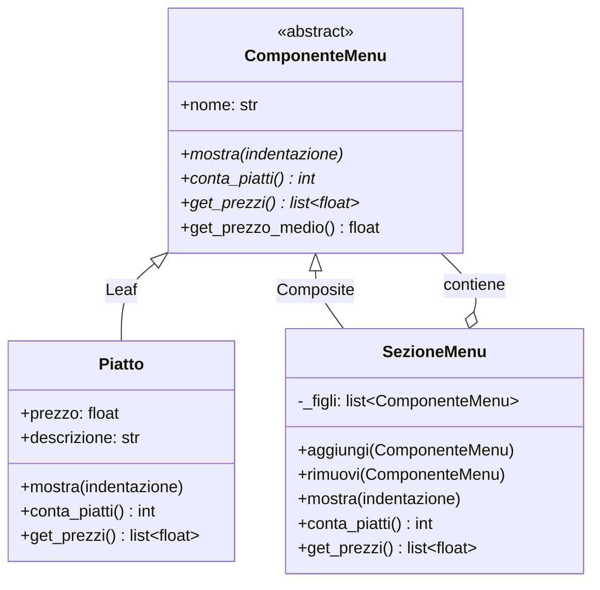
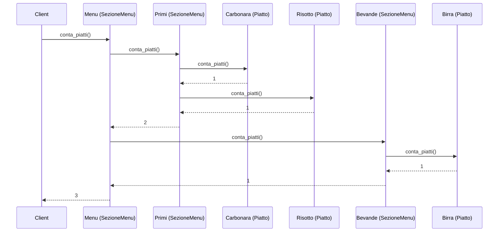

# Composite Pattern

## Problema

Questo pattern si applica a situazioni in cui si lavora con strutture dati ad albero, dove ogni nodo può essere un **nodo interno** o una **foglia**. La difficoltà nasce dal fatto che i due tipi hanno comportamenti diversi: una foglia esegue un'operazione specifica, mentre un nodo interno deve iterare sui propri figli per eseguire la stessa operazione.

Gli approcci naïve tipici sono due, entrambi problematici:
- **Raccolta in lista**: appiattire la struttura in una lista lineare per poi iterarla — difficile da gestire su strutture complesse e profonde.
- **Catena di if/switch**: distinguere a runtime i tipi di nodo — fragile e difficile da mantenere, soprattutto quando si aggiungono nuovi tipi di nodo.

Analogia reale: un catalogo e-commerce con prodotti (foglie) e categorie (nodi interni) che possono contenere altre categorie o prodotti. Calcolare il prezzo totale di un carrello, o applicare uno sconto a un'intera categoria, richiede di iterare sull'albero distinguendo foglie e nodi interni — complessità che esplode rapidamente.

## Soluzione

La soluzione è il pattern **Composite**, che permette di trattare uniformemente nodi interni e foglie, nascondendo la complessità della struttura sottostante. Il client interagisce con tutti i nodi tramite la stessa interfaccia, senza doversi preoccupare del tipo specifico.

I tre attori:

1. **Component** (interfaccia comune): definisce i metodi condivisi da foglie e nodi interni (es. `operation()`, opzionalmente `add()`, `remove()`).
2. **Leaf**: implementa `Component` ma non ha figli. I metodi `add()` e `remove()`, se presenti nell'interfaccia, non fanno nulla o lanciano un'eccezione.
3. **Composite**: implementa `Component` e mantiene una lista di figli (di tipo `Component`, quindi può contenere sia foglie che altri Composite). Implementa `operation()` iterando sui figli e delegando la chiamata a ciascuno.

In questo modo, chiamare `operation()` sul nodo radice propaga automaticamente l'operazione sull'intera struttura, senza che il client debba distinguere tra i tipi di nodo.

> **N.B.**: i metodi `add()` e `remove()` possono essere definiti solo nella classe `Composite` e non nell'interfaccia `Component`. Questo evita metodi vuoti o eccezioni nella classe `Leaf`, a scapito però di un'interfaccia meno uniforme — è una scelta di design.

## 📊 Diagramma

### Diagramma generico

### Diagramma specifico — Menu ristorante

### Diagramma di sequenza — `conta_piatti()` ricorsivo

### Vantaggi

- **Uniformità**: il client non deve preoccuparsi se sta interagendo con un singolo oggetto o con un'intera struttura — tratta tutto come `Component`, eliminando i blocchi `if is_folder ... else ...`.
- **Flessibilità ed estensibilità**: grazie all'Open/Closed Principle, si possono aggiungere nuovi tipi di foglie o contenitori senza toccare il codice client esistente.
- **Gerarchie ricorsive pulite**: è il modo più naturale per rappresentare oggetti che contengono altri oggetti dello stesso tipo (es. file system, menu, organigrammi aziendali).
- **Riduzione del boilerplate**: il client invoca un unico metodo sulla radice e l'operazione si propaga automaticamente sull'intera struttura.

### Svantaggi

- **Design troppo generico**: è difficile limitare i componenti di un `Composite` tramite il sistema dei tipi. Se una `Scatola` dovesse contenere solo `Cibi`, non è possibile impedire a compile-time che venga inserito un `Martello` — il controllo va fatto a runtime, con meno sicurezza.
- **Violazione dei principi SOLID (LSP e ISP)**:
  - *Liskov Substitution Principle*: se `add()` e `remove()` sono nell'interfaccia comune, `Leaf` erediterà metodi che non può implementare correttamente (spesso lanciando eccezioni).
  - *Interface Segregation Principle*: le foglie sono costrette a dipendere da metodi che non usano.
- **Dilemma sicurezza vs uniformità**: rimuovere `add()` e `remove()` da `Leaf` risolve il problema SOLID, ma obbliga il client a fare cast per sapere se può aggiungere figli — perdendo l'uniformità che era il vantaggio principale del pattern.
- **Overhead di memoria/performance**: in strutture molto profonde, la ricorsione continua e la gestione di molti piccoli oggetti possono avere un impatto sulle prestazioni se non ottimizzate.