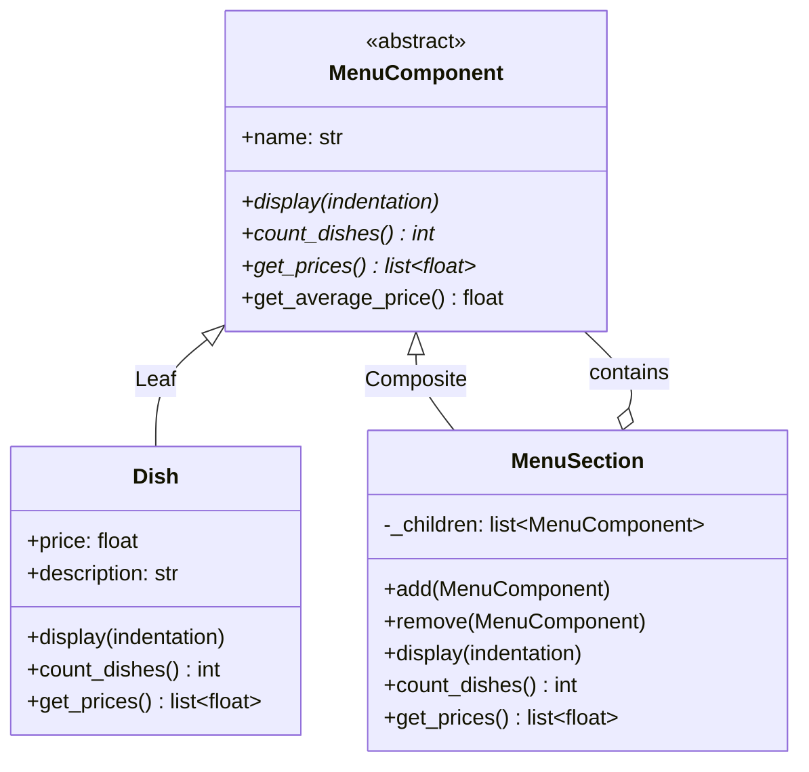
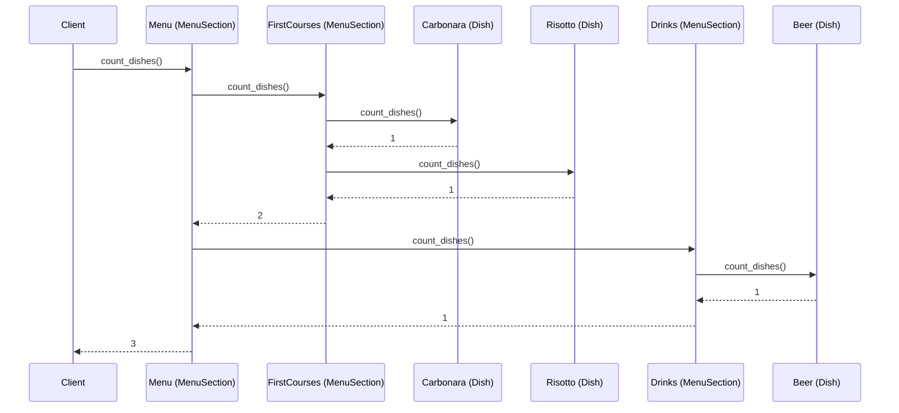

# Composite Pattern

## Problem

This pattern applies to situations where you work with tree data structures, where each node can be an **internal node** or a **leaf**. The difficulty arises because the two types have different behaviors: a leaf performs a specific operation, while an internal node must iterate over its children to perform the same operation.

The typical naïve approaches are two, both problematic:
- **Collection in a list**: flattening the structure into a linear list and then iterating over it — hard to manage on complex and deep structures.
- **Chain of if/switch**: distinguishing node types at runtime — fragile and hard to maintain, especially when adding new node types.

Real-world analogy: an e-commerce catalog with products (leaves) and categories (internal nodes) that can contain other categories or products. Calculating the total price of a cart, or applying a discount to an entire category, requires iterating over the tree distinguishing leaves and internal nodes — complexity that explodes rapidly.

## Solution

The solution is the **Composite** pattern, which allows treating internal nodes and leaves uniformly, hiding the complexity of the underlying structure. The client interacts with all nodes through the same interface, without worrying about the specific type.

The three actors:

1. **Component** (common interface): defines the methods shared by leaves and internal nodes (e.g. `operation()`, optionally `add()`, `remove()`).
2. **Leaf**: implements `Component` but has no children. The `add()` and `remove()` methods, if present in the interface, do nothing or throw an exception.
3. **Composite**: implements `Component` and maintains a list of children (of type `Component`, so it can contain both leaves and other Composites). Implements `operation()` by iterating over the children and delegating the call to each one.

This way, calling `operation()` on the root node automatically propagates the operation over the entire structure, without the client having to distinguish between node types.

> **N.B.**: the `add()` and `remove()` methods can be defined only in the `Composite` class and not in the `Component` interface. This avoids empty methods or exceptions in the `Leaf` class, at the cost of a less uniform interface — it's a design choice.

## Diagrams

### Generic Diagram

### Specific Diagram — Restaurant Menu

### Sequence Diagram

### Advantages

- **Uniformity**: the client doesn't need to worry about whether it's interacting with a single object or an entire structure — it treats everything as `Component`, eliminating the `if is_folder ... else ...` blocks.
- **Flexibility and Extensibility**: thanks to the Open/Closed Principle, new types of leaves or containers can be added without touching existing client code.
- **Clean Recursive Hierarchies**: it's the most natural way to represent objects that contain other objects of the same type (e.g. file systems, menus, corporate org charts).
- **Boilerplate Reduction**: the client invokes a single method on the root and the operation propagates automatically over the entire structure.

### Disadvantages

- **Overly Generic Design**: it's difficult to restrict the components of a `Composite` through the type system. If a `Box` should contain only `Foods`, it's not possible to prevent at compile-time that a `Hammer` gets inserted — the check must be done at runtime, with less safety.
- **Violation of SOLID Principles (LSP and ISP)**:
  - *Liskov Substitution Principle*: if `add()` and `remove()` are in the common interface, `Leaf` will inherit methods it can't implement correctly (often throwing exceptions).
  - *Interface Segregation Principle*: leaves are forced to depend on methods they don't use.
- **Safety vs Uniformity Dilemma**: removing `add()` and `remove()` from `Leaf` solves the SOLID problem, but forces the client to cast to know if it can add children — losing the uniformity that was the pattern's main advantage.
- **Memory/Performance Overhead**: in very deep structures, continuous recursion and managing many small objects can impact performance if not optimized.