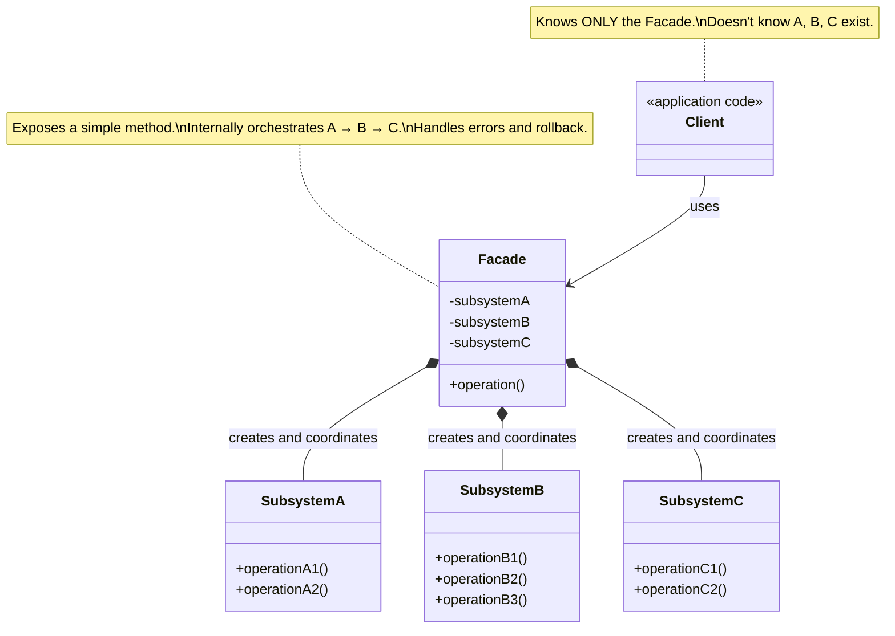
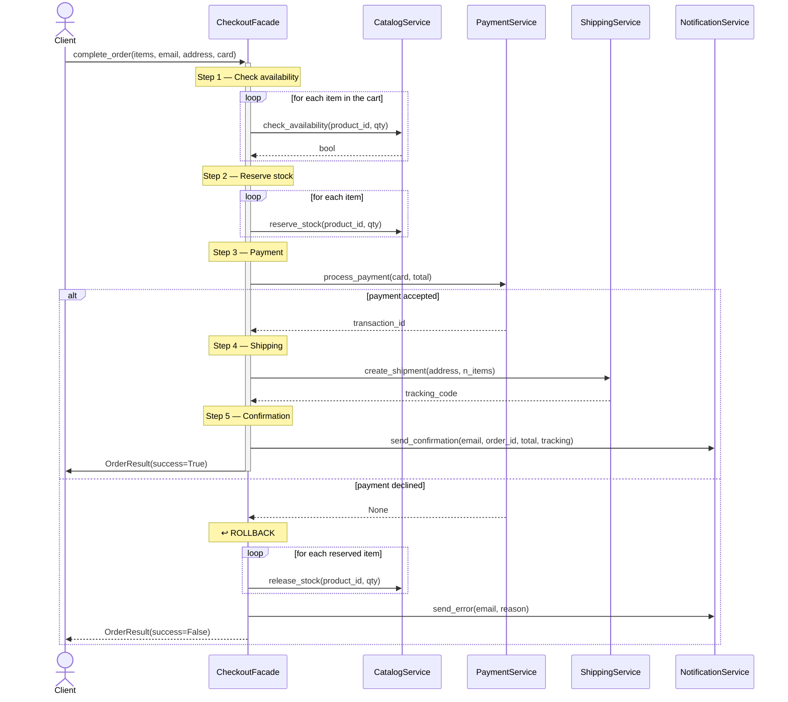

# Facade Pattern

## Problem

Let's imagine a situation that is already quite complex by default, where we need to interact with many different classes and objects, each with its own interface and usage mode. To perform a simple operation we might have to:

- operation A on class `X` (e.g. a login)
- operation B on class `X` (e.g. a data request)
- operation C on class `Y` (e.g. another login)
- operation D on class `Y` (e.g. a data request)
- operation E: merge the data obtained from `X` and `Y`
- operation F: pass the data to class `Z` (e.g. a display system)

Managing all of this on the client side is inconvenient, hard to maintain and hard to understand. If we wanted to change one of the classes or add a new operation, we'd have to modify all the client code, with a high risk of introducing bugs.

A real-world analogy could be organizing a graduation party at a hotel, since to organize everything we'd have to:
- book the hall with the hotel manager
- book the catering with the catering manager
- book the music with the music manager
- book the flowers with the flower manager

Obviously it's impractical, and if we wanted to change something (e.g. the catering) we'd have to contact the catering manager first, but also (hypothetically) the hall and/or music managers, to make sure everything is compatible and there are no coordination problems.

## Solution

The solution is to introduce a **Facade** object that hides the complexity of the underlying system, providing a simplified interface to the client.

In our example, the **Facade** will handle executing all operations (A, B, C, D, E, F) transparently: the client calls a single operation (e.g. `execute()`) and the Facade manages everything else. If an internal operation changes, only the Facade is modified — the client code remains unchanged.

In the graduation party analogy, the Facade is the **Wedding Planner**: we tell them what we want, and they coordinate the hall, catering, music and flowers. If we want to change the catering, we only tell them.

> **N.B.**: the Facade does not introduce new functionality or behaviors. The complexity of the underlying system doesn't disappear — it is simply hidden behind a simpler and more manageable interface.

**N.B.**: A good Facade should not prevent access to the complex subsystem. If an "expert client" needed granular control that the Facade doesn't offer, they should still be able to interact directly with the original classes (X, Y or Z). The Facade is a convenience, not a prison.

## Diagrams

### Generic Diagram

### Specific Diagram

### Sequence Diagram

As you can see, the client calls a single method `complete_order()`, all the complexity is hidden inside the Facade, which handles orchestrating the calls to the various services and managing errors and rollback in case of problems.

### Advantages

The Facade is one of the best tools for fighting "spaghetti code":

- **Reduced coupling**: the client doesn't know the subsystem classes. If you want to replace `Class X` with a new version or library, you only need to modify the Facade — the client will remain intact and unaware of the change.
- **Ease of use**: drastically reduces the learning curve. Instead of learning 10 different APIs, developers only need to know the 2-3 methods exposed by the Facade.
- **Better layered organization**: in modern architectures, the Facade acts as an "entry point" for an entire module, clearly defining what is public and what is a private implementation detail.
- **Error prevention**: by automating the correct order of calls (first A, then B, then C), the Facade prevents the client from forgetting a critical step (e.g. logging in before requesting data).

### Disadvantages

If used poorly, the Facade can introduce problems:

- **"God Object" risk**: if the subsystem is huge, the Facade risks becoming a massive class that does too much and "knows" too much, violating the Single Responsibility Principle.
- **Access barrier (if poorly designed)**: overly rigid encapsulation could prevent advanced clients from performing specific operations that the Facade didn't anticipate.
- **Maintaining the Facade itself**: every time the subsystem changes radically, the Facade must be updated — it becomes an additional layer of code to maintain and test.
- **False sense of simplicity**: hiding complexity doesn't mean eliminating it. If the subsystem is inefficient, the Facade will only give the illusion that everything works well, making debugging harder for those who don't know the internal details.