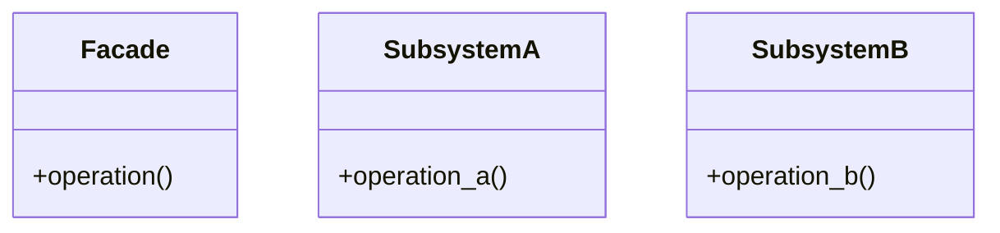

# Facade Pattern

## Problema

Ipotizziamo di trovarci in una situazione già di default abbastanza complessa, con la necessità di interagire con tante classi e oggetti diversi, ognuno con la propria interfaccia e modalità di utilizzo. Per eseguire una semplice operazione potremmo dover fare:

- operazione A su classe `X` (es. un login)
- operazione B su classe `X` (es. una richiesta di dati)
- operazione C su classe `Y` (es. un altro login)
- operazione D su classe `Y` (es. una richiesta di dati)
- operazione E: fondere i dati ottenuti da `X` e `Y`
- operazione F: passare i dati alla classe `Z` (es. un sistema di visualizzazione)

Gestire tutto questo lato client è scomodo, difficile da mantenere e da capire. Se volessimo cambiare una delle classi o aggiungere una nuova operazione, dovremmo modificare tutto il codice client, con un alto rischio di introdurre bug.

Un'analogia reale potrebbe essere quella dell'organizzzzione di una festa di laurea in un hotel, siccome per organizzare il tutto dovremmo:
- prenotare la sala con il responsabile dell'hotel
- prenotare il catering con il responsabile del catering
- prenotare la musica con il responsabile della musica
- prenotare i fiori con il responsabile dei fiori

Ovviamente è poco realizzabile, e nel caso in cui volessimo cambiare qualcosa (ad esempio il catering) dovremmo contattare innanzitutto il responsabile del catering, ma anche (ipoteticamente) il responsabile della sala e/o della musica, per assicurarci che tutto sia compatibile e che non ci siano problemi di coordinamento.

## Soluzione

La soluzione è introdurre un oggetto **Facade** che nasconda la complessità del sistema sottostante, fornendo un'interfaccia semplificata al client.

Nel nostro esempio, il **Facade** si occuperà di eseguire tutte le operazioni (A, B, C, D, E, F) in modo trasparente: il client chiama un'unica operazione (es. `execute()`) e il Facade gestisce tutto il resto. Se un'operazione interna cambia, si modifica solo il Facade — il codice client rimane invariato.

Nell'analogia della festa di laurea, il Facade è il **Wedding Planner**: noi gli diciamo cosa vogliamo, lui coordina sala, catering, musica e fiori. Se vogliamo cambiare il catering, lo diciamo solo a lui.

> **N.B.**: il Facade non introduce nuove funzionalità o comportamenti. La complessità del sistema sottostante non sparisce — viene semplicemente nascosta dietro un'interfaccia più semplice e gestibile.

**N.B.**: Una buona Facade non dovrebbe impedire l'accesso al sottosistema complesso. Se un "client esperto" avesse bisogno di un controllo granulare che la Facade non offre, dovrebbe comunque poter interagire direttamente con le classi originali (X, Y o Z). La Facade è una comodità, non una prigione

## 📊 Diagramma

### Vantaggi

Il Facade è uno degli strumenti migliori per combattere il "codice a spaghetti":

- **Riduzione dell'accoppiamento**: il client non conosce le classi del sottosistema. Se si vuole sostituire la `Classe X` con una nuova versione o libreria, sarà necessario modificare solo il Facade — il client rimarrà intatto e ignaro del cambiamento.
- **Semplicità d'uso**: riduce drasticamente la curva di apprendimento. Invece di imparare 10 API diverse, gli sviluppatori devono conoscere solo i 2-3 metodi esposti dal Facade.
- **Migliore organizzazione a livelli**: nelle architetture moderne, il Facade funge da "punto di ingresso" per un intero modulo, definendo chiaramente cosa è pubblico e cosa è un dettaglio di implementazione privato.
- **Prevenzione di errori**: automatizzando l'ordine corretto delle chiamate (prima A, poi B, poi C), il Facade evita che il client dimentichi un passaggio critico (es. effettuare il login prima di richiedere i dati).

### Svantaggi

Se usato male, il Facade può introdurre problemi:

- **Rischio "God Object"**: se il sottosistema è enorme, il Facade rischia di diventare una classe gigantesca che fa troppe cose e "sa" troppo, violando il Single Responsibility Principle.
- **Barriera all'accesso (se mal progettato)**: un incapsulamento troppo rigido potrebbe impedire ai client avanzati di eseguire operazioni specifiche che il Facade non ha previsto.
- **Manutenzione del Facade stesso**: ogni volta che il sottosistema cambia in modo radicale, il Facade va aggiornato — diventa un ulteriore strato di codice da mantenere e testare.
- **Falsa sensazione di semplicità**: nascondere la complessità non significa eliminarla. Se il sottosistema è inefficiente, il Facade darà solo l'illusione che tutto funzioni bene, rendendo il debugging più difficile per chi non conosce i dettagli interni.