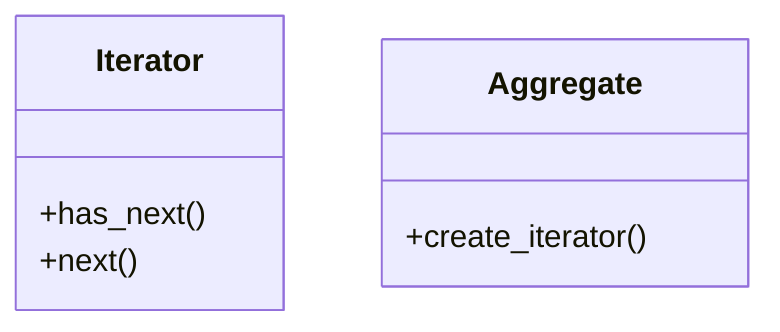

# Iterator Pattern

## 🎯 Problema

_Da completare_

## ✅ Soluzione

_Da completare_

## 📊 Diagramma

## 🌍 Analogia Reale

_Da completare_

## 🔗 Vedi Anche

- [Pattern Comportamentali](../)
- Observer
