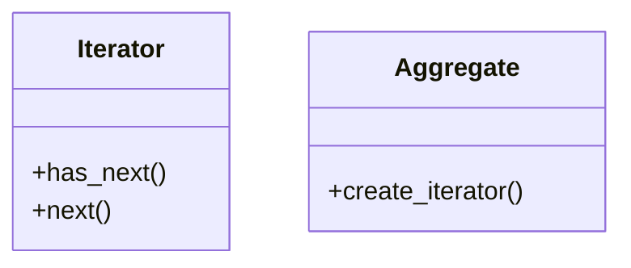

# Iterator Pattern

## Problema

Ipotizziamo di avere una collezione di oggetti e di volerla iterare. Per strutture semplici (array, liste) è immediato, ma quando la struttura diventa complessa (lista di liste, albero, grafo) il client si ritrova a dover conoscere e gestire i dettagli interni della struttura per poterla attraversare correttamente. Se la struttura cambia, il client va modificato di conseguenza.

Inoltre, una stessa struttura può essere attraversata in modi diversi (es. un albero in pre-ordine, in-ordine o post-ordine): il client dovrebbe gestire tutte queste varianti, rischiando di diventare una god class che sa troppo sulla struttura dati.

Analogia reale: un telecomando della tv che deve iterare su vari tipi di canali (es. canali lineari, on-demand, streaming). Se il telecomando dovesse conoscere fisicamente i dettagli di ogni tipo di canale, sarebbe poco maneggevole e troppo complesso. 

## Soluzione

La soluzione è il pattern **Iterator**, che separa la logica di iterazione dalla struttura dati sottostante. Il client può iterare su qualsiasi collezione senza conoscerne la struttura interna; la collezione può cambiare senza influenzare il client.

I quattro attori:

1. **`Iterator`** (interfaccia): definisce i metodi `has_next()` e `next()`. Il client conosce solo questa interfaccia — non sa nulla della struttura dati sottostante.
2. **`ConcreteIterator`**: implementa `Iterator` e mantiene un riferimento alla collezione. Nasconde la complessità della struttura implementando `has_next()` e `next()` in modo corretto per quel caso specifico.
3. **`Aggregate`** (interfaccia): espone il metodo `create_iterator()`, che restituisce un'istanza di `Iterator`. È l'interfaccia che ogni collezione implementerà.
4. **`ConcreteAggregate`**: implementa `Aggregate` e contiene la collezione. Il metodo `create_iterator()` restituisce un `ConcreteIterator` configurato per iterare su quella collezione.

Lato client: si chiama `create_iterator()` sulla collezione e si usa l'iteratore restituito tramite `has_next()` / `next()`, senza sapere nulla della struttura interna. Se la struttura dati cambia, basta aggiornare `create_iterator()` — il client rimane invariato.

> **N.B.**: l'utilizzo dell'interfaccia `Aggregate` permette di scrivere un algoritmo che funzioni con qualsiasi collezione che implementi quell'interfaccia, senza dover conoscere i dettagli di ogni collezione specifica. Il client è completamente disaccoppiato dalle implementazioni concrete delle collezioni e degli iteratori.

> **N.B.**: i nomi dei metodi (`has_next`, `next`) sono convenzionali; possono variare e possono essere presenti metodi aggiuntivi (es. `reset()`).

## 📊 Diagramma

### Vantaggi

- **Single Responsibility Principle (SRP)**: separando la logica di navigazione dalla collezione, l'`Aggregate` si concentra solo sulla gestione dei dati — la logica di "come" muoversi tra i dati vive nell'iteratore.
- **Open/Closed Principle (OCP)**: si possono aggiungere nuovi tipi di iteratori (es. `RandomIterator`) senza modificare né la collezione né il client.
- **Iterazioni multiple e simultanee**: lo stato dell'iterazione (indice corrente, puntatore) è memorizzato nell'`Iterator`, non nella collezione. È quindi possibile avere più iteratori attivi sulla stessa struttura contemporaneamente, ognuno con la propria posizione indipendente.
- **Interfaccia uniforme**: il client interagisce con strutture dati radicalmente diverse (array, albero, grafo) usando sempre lo stesso codice (`iterator.next()`), rendendo il client generico e riutilizzabile.
- **Astrazione della complessità**: nasconde i dettagli di implementazione. Se scorrere un grafo richiede un algoritmo come la BFS, il client non ne vede la complessità — vede solo una sequenza di elementi.

### Svantaggi

- **Over-engineering per strutture semplici**: se l'applicazione usa solo liste o array e non servono polimorfismo o iterazioni speciali, applicare l'Iterator è eccessivo. Un semplice `for` nativo è più leggibile e immediato.
- **Overhead di performance**: l'uso di un oggetto `Iterator` introduce una piccola penalità — allocazione di un nuovo oggetto e costo della chiamata indiretta tramite interfaccia — rispetto all'accesso diretto alla memoria di un array.
- **Aumento della verbosità**: il pattern richiede almeno due interfacce (`Iterator` e `Aggregate`) e due classi concrete, aumentando il numero di file e la struttura complessiva del progetto.
- **Problemi con modifiche concorrenti**: se una collezione viene modificata (aggiunta/rimozione di elementi) mentre un iteratore è attivo, l'iteratore potrebbe saltare elementi o restituire errori. Gestire questa situazione con iteratori "fail-fast" aggiunge ulteriore complessità implementativa.