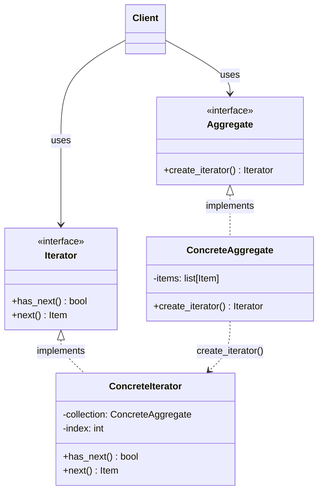
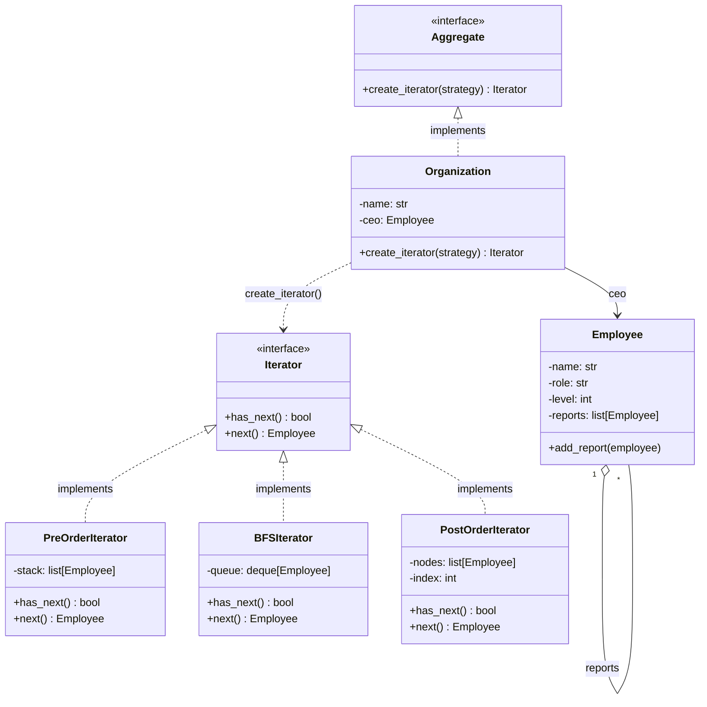
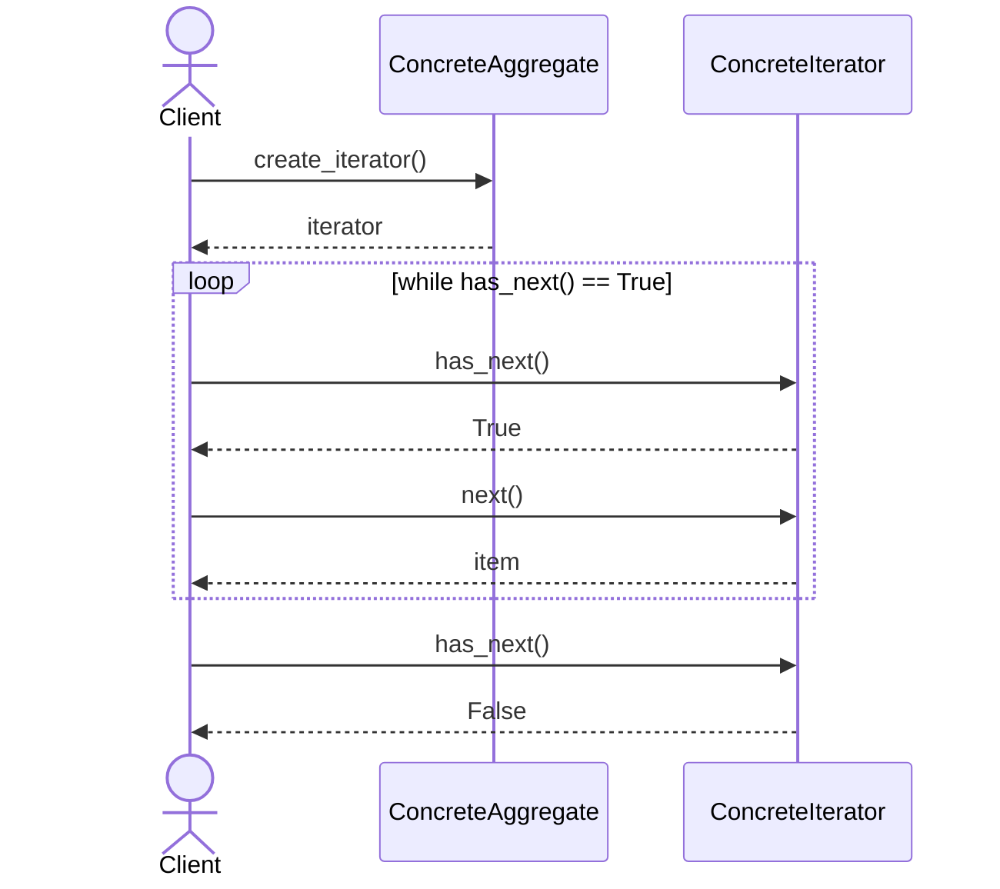

# Iterator Pattern

## Problem

Let's assume we have a collection of objects and we want to iterate over it. For simple structures (arrays, lists) it's straightforward, but when the structure becomes complex (list of lists, tree, graph) the client ends up having to know and manage the internal details of the structure in order to traverse it correctly. If the structure changes, the client must be modified accordingly.

Furthermore, the same structure can be traversed in different ways (e.g., a tree in pre-order, in-order, or post-order): the client would have to handle all these variants, risking becoming a god class that knows too much about the data structure.

Real-world analogy: a TV remote control that must iterate over various types of channels (e.g., linear channels, on-demand, streaming). If the remote had to physically know the details of each type of channel, it would be unwieldy and overly complex.

## Solution

The solution is the **Iterator** pattern, which separates the iteration logic from the underlying data structure. The client can iterate over any collection without knowing its internal structure; the collection can change without affecting the client.

The four actors:

1. **`Iterator`** (interface): defines the methods `has_next()` and `next()`. The client only knows this interface — it knows nothing about the underlying data structure.
2. **`ConcreteIterator`**: implements `Iterator` and maintains a reference to the collection. It hides the complexity of the structure by implementing `has_next()` and `next()` correctly for that specific case.
3. **`Aggregate`** (interface): exposes the method `create_iterator()`, which returns an instance of `Iterator`. This is the interface that every collection will implement.
4. **`ConcreteAggregate`**: implements `Aggregate` and contains the collection. The `create_iterator()` method returns a `ConcreteIterator` configured to iterate over that collection.

On the client side: you call `create_iterator()` on the collection and use the returned iterator via `has_next()` / `next()`, without knowing anything about the internal structure. If the data structure changes, you only need to update `create_iterator()` — the client remains unchanged.

> **N.B.**: the use of the `Aggregate` interface allows writing an algorithm that works with any collection implementing that interface, without needing to know the details of each specific collection. The client is completely decoupled from the concrete implementations of collections and iterators.

> **N.B.**: the method names (`has_next`, `next`) are conventional; they may vary and additional methods may be present (e.g., `reset()`).

> **N.B.**: this pattern is different from the **Composite** pattern: Composite is a structural pattern that deals with organizing classes and their relationships, while Iterator is a behavioral pattern that defines how the user interacts with classes. Often what happens is that a complex class with a recursive structure (like a tree) is implemented using Composite, and then an iterator is provided to traverse it using Iterator. But they are two distinct patterns with different purposes.

## Diagrams

### Generic Diagram

### Specific Diagram — Real Example

### Sequence Diagram

### Advantages

- **Single Responsibility Principle (SRP)**: by separating the navigation logic from the collection, the `Aggregate` focuses only on data management — the logic of "how" to move through the data lives in the iterator.
- **Open/Closed Principle (OCP)**: new types of iterators (e.g., `RandomIterator`) can be added without modifying either the collection or the client.
- **Multiple and simultaneous iterations**: the iteration state (current index, pointer) is stored in the `Iterator`, not in the collection. Therefore, it is possible to have multiple active iterators on the same structure simultaneously, each with its own independent position.
- **Uniform interface**: the client interacts with radically different data structures (array, tree, graph) always using the same code (`iterator.next()`), making the client generic and reusable.
- **Complexity abstraction**: hides implementation details. If traversing a graph requires an algorithm like BFS, the client doesn't see the complexity — it only sees a sequence of elements.

### Disadvantages

- **Over-engineering for simple structures**: if the application only uses lists or arrays and doesn't need polymorphism or special iterations, applying the Iterator is excessive. A simple native `for` loop is more readable and straightforward.
- **Performance overhead**: using an `Iterator` object introduces a small penalty — allocation of a new object and the cost of indirect calls through the interface — compared to direct memory access of an array.
- **Increased verbosity**: the pattern requires at least two interfaces (`Iterator` and `Aggregate`) and two concrete classes, increasing the number of files and the overall project structure.
- **Problems with concurrent modifications**: if a collection is modified (adding/removing elements) while an iterator is active, the iterator might skip elements or return errors. Handling this situation with "fail-fast" iterators adds further implementation complexity.