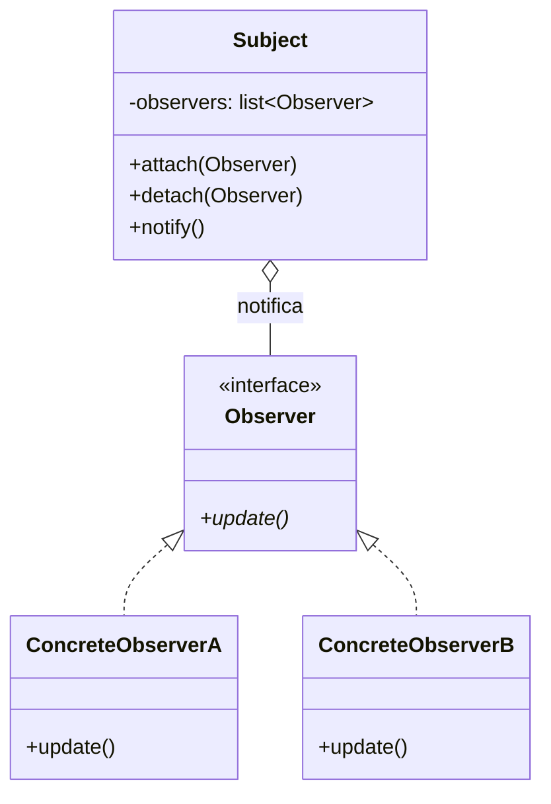
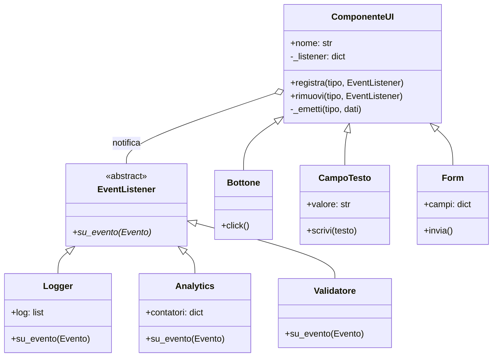
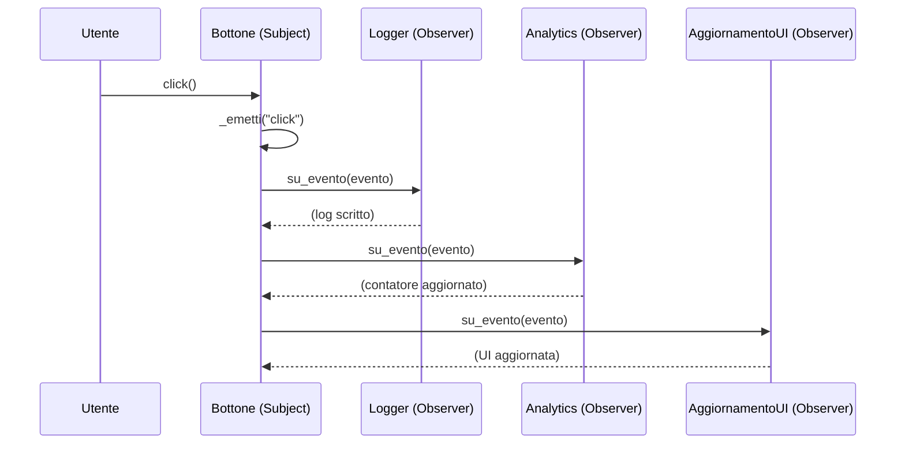

# Observer Pattern

## 🎯 Problema

Ipotizziamo di avere un oggetto `A` che cambia il proprio stato interno, e un altro oggetto `B` il cui stato è strettamente legato a quello di `A`. Per mantenersi aggiornato, `B` deve periodicamente chiedere ad `A` se il suo stato è cambiato — questo approccio è detto **polling**.

Se entrano in gioco altri oggetti `C`, `D`, `E` con la stessa esigenza, `A` viene bombardato da richieste continue di stato provenienti da tutti, rendendo il sistema inefficiente e difficile da scalare.

Analogia col mondo reale: pensiamo ad negoziante, che ha le sue cose da fare e gestire. Se ci fosse un cliente che periodicamente gli chiede se ha un certo prodotto in magazzinom vorrebbe dire che il negoziante dovrebber interrompere quello che sta facendo per rispondere al cliente. Se poi entrano in gioco altri clienti, allora il negoziante deve periodicamente interrompere quello che sta facendo per rispondere a tutti i clienti, non riuscendo più a concentrarsi su quello che sta facendo.

## ✅ Soluzione

La soluzione è il pattern **Observer**, che inverte la responsabilità: invece di far fare polling agli osservatori, è il **Subject** (`A`) a notificare proattivamente tutti gli interessati quando il proprio stato cambia.

I due attori principali:

- **Subject**: l'oggetto osservato. Mantiene una lista di **Observer** registrati e li notifica automaticamente ad ogni cambio di stato.
- **Observer**: ogni oggetto interessato allo stato del Subject. Implementa un'interfaccia comune con un metodo `update()`, chiamato dal Subject alla notifica.

I passi di implementazione:
1. Il `Subject` mantiene una lista di `Observer` registrati.
2. Il `Subject` espone metodi per aggiungere (`attach`) e rimuovere (`detach`) Observer dalla lista.
3. Gli `Observer` implementano un'interfaccia comune con il metodo `update()`.
4. Gli `Observer` si registrano presso il `Subject`.
5. Quando lo stato del `Subject` cambia, chiama `update()` su tutti gli Observer registrati.

L'interfaccia comune degli Observer è il punto chiave: permette al `Subject` di notificare chiunque senza conoscerne i dettagli. Il `Subject` è così completamente indipendente dagli Observer, che possono essere aggiunti o rimossi senza modificarlo.

Nell'analogia del negoziante: il negoziante è il `Subject`, i clienti sono gli `Observer`. Quando arriva un nuovo prodotto, il negoziante avvisa direttamente tutti i clienti interessati — senza aspettare che siano loro a chiedere.

## 📊 Diagramma

### Diagramma generico

### Diagramma specifico — Event-driven UI

### Diagramma di sequenza — Click su un bottone

### Vantaggi

- **Disaccoppiamento (Loose Coupling)**: il Subject sa solo che l'Observer implementa una certa interfaccia — non ha bisogno di conoscere la classe concreta, le sue dipendenze o la sua logica interna. Questo rende i componenti molto più indipendenti e riutilizzabili.
- **Open/Closed Principle**: si possono introdurre nuovi tipi di Observer senza modificare il Subject. Se oltre a un'email si vuole inviare anche un SMS o un log su file, basta creare una nuova classe Observer e registrarla.
- **Relazioni dinamiche**: il legame tra Subject e Observer viene stabilito a runtime. Gli Observer possono essere aggiunti o rimossi "al volo" in base allo stato dell'applicazione (es. attivare un grafico solo quando l'utente apre una certa finestra).
- **Comunicazione broadcast**: il Subject non si preoccupa di quanti Observer ci siano. Che ce ne sia uno o mille, il codice di notifica rimane invariato (`notify()`).

### Svantaggi

- **"Lapsed Listener" (memory leak)**: se un Observer viene registrato ma non rimosso con `detach()`, il Subject mantiene un riferimento a esso impedendo al Garbage Collector di liberarne la memoria — portando a un lento esaurimento delle risorse.
- **Aggiornamenti inefficienti**: gli Observer non conoscono l'esistenza l'uno dell'altro e il Subject non sa quanto sia costoso l'`update()` di ciascuno. Una singola modifica può innescare una catena di operazioni molto pesanti in termini di CPU.
- **Ordine di notifica non garantito**: il pattern non specifica l'ordine in cui gli Observer vengono notificati. Se la logica richiede che l'Observer `A` finisca prima dell'Observer `B`, il pattern standard non è lo strumento adatto.
- **Rischio di cicli infiniti**: se un Observer, reagendo a un aggiornamento, modifica a sua volta il Subject, si può creare un loop infinito di notifiche che porta al crash del sistema.