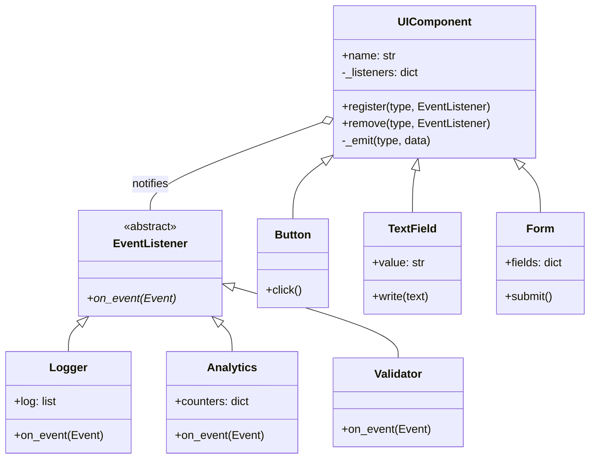
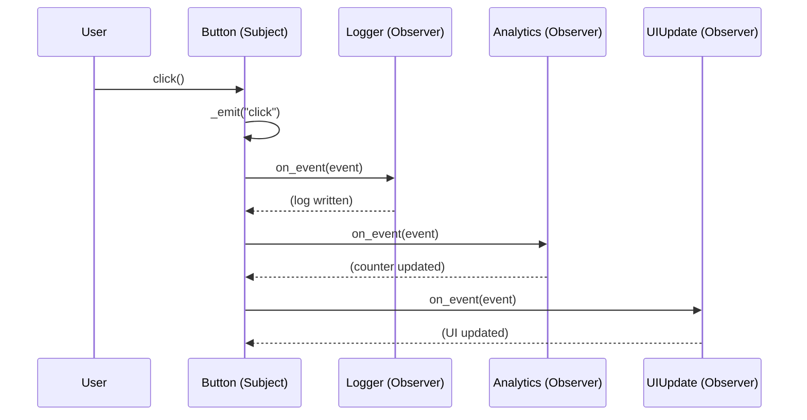

# Observer Pattern

## Problem

Let's assume we have an object `A` that changes its internal state, and another object `B` whose state is closely tied to that of `A`. To stay updated, `B` must periodically ask `A` whether its state has changed — this approach is called **polling**.

If other objects `C`, `D`, `E` come into play with the same need, `A` gets bombarded with continuous state requests from everyone, making the system inefficient and difficult to scale.

Real-world analogy: think of a shopkeeper, who has their own things to do and manage. If there were a customer who periodically asks them if a certain product is in stock, the shopkeeper would have to interrupt what they're doing to answer the customer. If more customers come into play, then the shopkeeper has to periodically interrupt what they're doing to answer all the customers, no longer being able to focus on what they're doing.

## Solution

The solution is the **Observer** pattern, which inverts the responsibility: instead of having observers poll, it is the **Subject** (`A`) that proactively notifies all interested parties when its state changes.

The two main actors:

- **Subject**: the observed object. It maintains a list of registered **Observers** and automatically notifies them on every state change.
- **Observer**: every object interested in the Subject's state. It implements a common interface with an `update()` method, called by the Subject upon notification.

The implementation steps:
1. The `Subject` maintains a list of registered `Observers`.
2. The `Subject` exposes methods to add (`attach`) and remove (`detach`) Observers from the list.
3. The `Observers` implement a common interface with the `update()` method.
4. The `Observers` register with the `Subject`.
5. When the `Subject`'s state changes, it calls `update()` on all registered Observers.

The common Observer interface is the key point: it allows the `Subject` to notify anyone without knowing their details. The `Subject` is thus completely independent of the Observers, which can be added or removed without modifying it.

In the shopkeeper analogy: the shopkeeper is the `Subject`, the customers are the `Observers`. When a new product arrives, the shopkeeper directly notifies all interested customers — without waiting for them to ask.

## Diagrams

### Generic Diagram

### Specific Diagram — Event-driven UI

### Sequence Diagram

### Advantages

- **Decoupling (Loose Coupling)**: the Subject only knows that the Observer implements a certain interface — it doesn't need to know the concrete class, its dependencies, or its internal logic. This makes the components much more independent and reusable.
- **Open/Closed Principle**: new types of Observers can be introduced without modifying the Subject. If in addition to an email you want to also send an SMS or log to a file, just create a new Observer class and register it.
- **Dynamic relationships**: the bond between Subject and Observer is established at runtime. Observers can be added or removed "on the fly" based on the application's state (e.g., activating a chart only when the user opens a certain window).
- **Broadcast communication**: the Subject doesn't worry about how many Observers there are. Whether there is one or a thousand, the notification code stays the same (`notify()`).

### Disadvantages

- **"Lapsed Listener" (memory leak)**: if an Observer is registered but not removed with `detach()`, the Subject maintains a reference to it preventing the Garbage Collector from freeing its memory — leading to a slow exhaustion of resources.
- **Inefficient updates**: Observers don't know about each other's existence and the Subject doesn't know how expensive each one's `update()` is. A single modification can trigger a chain of very expensive CPU operations.
- **Notification order not guaranteed**: the pattern does not specify the order in which Observers are notified. If the logic requires Observer `A` to finish before Observer `B`, the standard pattern is not the right tool.
- **Risk of infinite cycles**: if an Observer, reacting to an update, modifies the Subject in turn, it can create an infinite notification loop that leads to system crash.