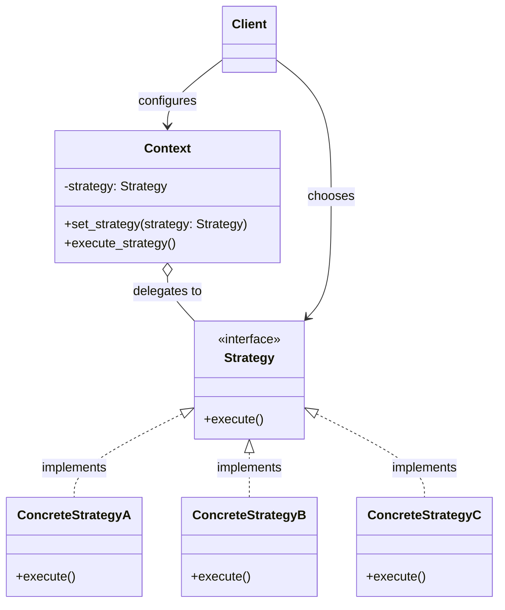
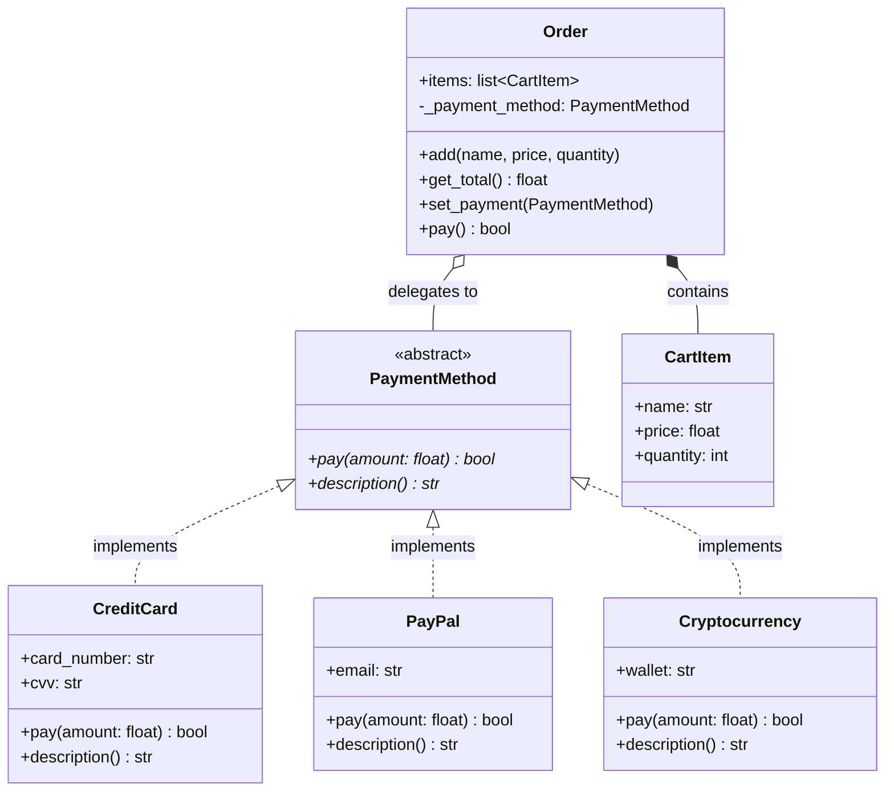
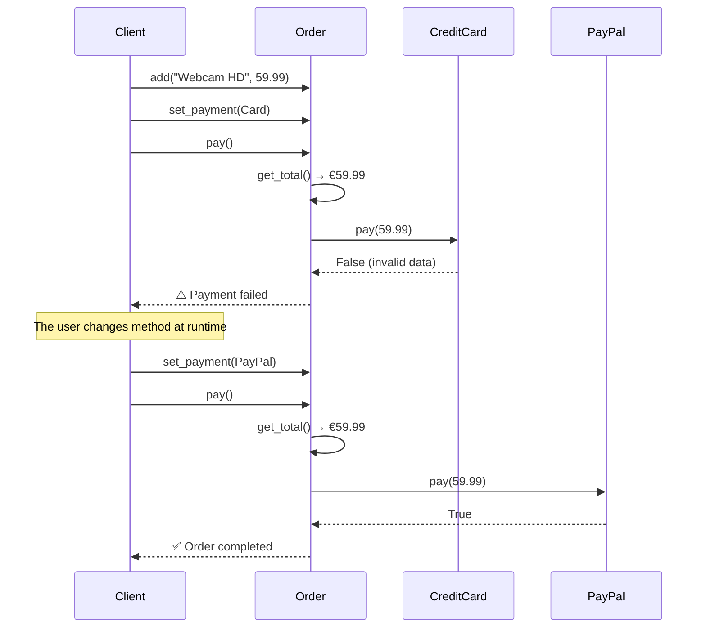

# Strategy Pattern

## Problem

Imagine a situation where we have a **family of algorithms** or similar behaviors, but with specific differences. These algorithms are used by our client code, and it's the client that specifies which algorithm to use and when. Consequently, the class implementing those algorithms must know all possible algorithms, must have different methods for different algorithms, and must be modified every time a new algorithm is added. This leads to code that is hard to maintain, extend, and test.

Analogy: it's as if we had to choose whether to visit the city by car, bicycle, or public transport, and we call a single "guide" who must provide all the information for every means of transport, and must be updated every time a new one is added (e.g., electric scooter). The guide becomes a "Swiss army knife" with all the information, but it's hard to maintain and use — or simply, for a human it's hard to remember all that information.

## Solution

The solution is the **Strategy** pattern: we create a dedicated class for each specific algorithm, and a **context** class that holds a reference to a strategy and delegates execution to it. This way the client can choose which strategy to use at runtime, without modifying the context or the algorithm classes. Adding a new strategy is simple: just create a new class that implements the `Strategy` interface, making the system open for extension but closed for modification (**Open/Closed Principle**).

The four actors:

1. **`Strategy`** (interface): defines the abstract method common to all algorithms (e.g., `execute()`). The `Context` and the client only know this interface.
2. **`ConcreteStrategy`**: implements `Strategy` with a specific algorithm (e.g., `ConcreteStrategyA`, `ConcreteStrategyB`). Each variant lives in its own isolated class.
3. **`Context`**: maintains a reference to a `Strategy` instance and delegates execution via `execute_strategy()`. Exposes `set_strategy()` to change the algorithm at runtime.
4. **Client**: instantiates the `Context` and chooses which `ConcreteStrategy` to assign to it, without touching either the context or the other strategies.

> **N.B.**: the `Context` class is often initialized with data that the strategies then use to run their algorithms; this way strategies are more flexible and can operate on different data depending on the context in which they are used.

> **Analogy**: instead of having a guide that contains all the information, we have a guide that says "Here are the available transport options, choose the one you prefer." The client picks a strategy (e.g., "Use the car") and provides the concrete strategy to the context class; the guide will use that expert to perform all the necessary operations. If a new means of transport is added, just add a new expert class — the existing classes don't need to be touched.

## Diagrams

### Generic Diagram

### Specific Diagram — E-commerce Payment

### Sequence Diagram

### Advantages

- **Open/Closed Principle compliance**: you can introduce new algorithms (new strategies) without touching a single line of code in the existing strategies or the `Context`. This drastically reduces the risk of introducing regressions.
- **Complexity isolation (Separation of Concerns)**: each strategy is a "black box" that deals with one thing only. The `Context` code stays clean and focuses on high-level logic, while the technical details of the algorithm remain confined within the `ConcreteStrategy` classes.
- **Elimination of "Conditional Bloat"**: the endless `if-else` or `switch` blocks that make methods long and hard to read are eliminated. Polymorphism does the work: you call `strategy.execute()` and the language already knows which code to run.
- **Superior testability**: since each strategy is a separate class, it can be tested in complete isolation with dedicated unit tests, without having to configure the entire environment.
- **Runtime behavior change**: unlike the Template Method (static, decided at compile time), the Strategy allows changing behavior while the app is running — just pass a new strategy object to the context.

### Disadvantages

- **Increased number of classes (Class Explosion)**: if the algorithms are very simple and rarely change, creating an interface and multiple concrete classes can be over-engineering. Sometimes a simple function or a lambda is enough.
- **The client must "know too much"**: to choose the correct strategy, the client must know the differences between them, partially negating the benefit of abstraction.
- **Communication overhead**: the `Context` and the `Strategy` must exchange data. If the strategy needs a lot of data from the context, you must pass it as arguments or pass the entire context object, creating unwanted coupling.
- **Comprehension complexity for beginners**: following the code flow is harder compared to a sequential file with `if-else` — you need to jump between different classes and interfaces to understand what happens.