# Strategy Pattern

## Problema

Ipotizziamo di trovarci in una situazione in cui abbiamo una **famiglia di algoritmi** o comportamenti simili, ma con differenze specifiche. Questi algoritmi vengono usati dal nostro codice client, ed è quindi il client a specificare man mano quale algoritmo usare e quando. Di conseguenza la classe che implementa quegli algoritmi deve conoscere tutti i possibili algoritmi, deve avere metodi diversi per algoritmi diversi, e deve essere modificata ogni volta che si aggiunge un nuovo algoritmo. Questo porta a un codice difficile da mantenere, estendere e testare.

Analogia: è come se noi dovessimo scegliere se visitare la città usando l'auto, la bicicletta o i mezzi pubblici, e chiamiamo una singola "guida" la quale deve fornirci tutte le informazioni per ogni mezzo di trasporto, e deve essere aggiornata ogni volta che viene aggiunto un nuovo mezzo (es. scooter elettrico). La guida diventa un "coltellino svizzero" con tutte le informazioni, ma è difficile da mantenere e da usare, o banalmente per un essere umano è difficile ricordare tutte quelle informazioni.

## Soluzione

La soluzione è il pattern **Strategy**: si crea una classe dedicata per ogni algoritmo specifico, e una classe **contesto** che contiene un riferimento a una strategia e delega a essa l'esecuzione. In questo modo il client può scegliere quale strategia usare a runtime, senza dover modificare il contesto o le classi degli algoritmi. L'aggiunta di una nuova strategia è semplice: basta creare una nuova classe che implementa l'interfaccia `Strategy`, rendendo il sistema aperto all'estensione ma chiuso alla modifica (**Open/Closed Principle**).

I quattro attori:

1. **`Strategy`** (interfaccia): definisce il metodo astratto comune a tutti gli algoritmi (es. `execute()`). Il `Context` e il client conoscono solo questa interfaccia.
2. **`ConcreteStrategy`**: implementa `Strategy` con un algoritmo specifico (es. `ConcreteStrategyA`, `ConcreteStrategyB`). Ogni variante vive nella propria classe isolata.
3. **`Context`**: mantiene un riferimento a un'istanza di `Strategy` e delega l'esecuzione tramite `execute_strategy()`. Espone `set_strategy()` per cambiare algoritmo a runtime.
4. **Client**: istanzia il `Context` e sceglie quale `ConcreteStrategy` assegnargli, senza toccare né il contesto né le altre strategie.

> **N.B.**: la classe `Context` spesso viene inizializzata con dei dati che poi vengono usati dalle strategie per eseguire i loro algoritmi; in questo modo le strategie sono più flessibili e possono operare su dati diversi a seconda del contesto in cui vengono usate.

> **Analogia**: invece di avere una guida che contiene tutte le informazioni, abbiamo una guida che ci dice "Ecco le opzioni di trasporto disponibili, scegli quella che preferisci". Il client sceglie una strategia (es. "Usa l'auto") e fornisce la strategia concreta alla classe contesto; la guida userà quell'esperto per fare tutte le operazioni necessarie. Se viene aggiunto un nuovo mezzo di trasporto, basta aggiungere una nuova classe esperta — le classi esistenti non vanno toccate.

## 📊 Diagramma

### Diagramma generico

### Diagramma specifico — Pagamento E-commerce

### Diagramma di sequenza — Checkout con cambio metodo

```mermaid
sequenceDiagram
    participant Client
    participant Ordine
    participant Carta as CartaDiCredito
    participant PP as PayPal

    Client->>Ordine: aggiungi("Webcam HD", 59.99)
    Client->>Ordine: imposta_pagamento(Carta)
    Client->>Ordine: paga()
    Ordine->>Ordine: get_totale() → €59.99
    Ordine->>Carta: paga(59.99)
    Carta-->>Ordine: False (dati non validi)
    Ordine-->>Client: ⚠️ Pagamento fallito

    Note over Client: L'utente cambia metodo a runtime

    Client->>Ordine: imposta_pagamento(PayPal)
    Client->>Ordine: paga()
    Ordine->>Ordine: get_totale() → €59.99
    Ordine->>PP: paga(59.99)
    PP-->>Ordine: True
    Ordine-->>Client: ✅ Ordine completato
```

### Vantaggi

- **Rispetto dell'Open/Closed Principle**: puoi introdurre nuovi algoritmi (nuove strategie) senza toccare una singola riga di codice delle strategie esistenti o del `Context`. Questo riduce drasticamente il rischio di introdurre regressioni.
- **Isolamento della complessità (Separation of Concerns)**: ogni strategia è una "scatola nera" che si occupa di una sola cosa. Il codice del `Context` rimane pulito e si concentra sulla logica di alto livello, mentre i dettagli tecnici dell'algoritmo rimangono confinati nelle classi `ConcreteStrategy`.
- **Eliminazione dei "Conditional Bloat"**: si eliminano gli infiniti blocchi `if-else` o `switch` che rendono i metodi lunghi e difficili da leggere. Il polimorfismo fa il lavoro: si chiama `strategy.execute()` e il linguaggio sa già quale codice eseguire.
- **Testabilità superiore**: ogni strategia essendo una classe separata può essere testata in totale isolamento con unit test dedicati, senza dover configurare l'intero ambiente.
- **Cambio di comportamento a runtime**: a differenza del Template Method (statico, deciso alla compilazione), lo Strategy permette di cambiare comportamento mentre l'app è in esecuzione — basta passare un nuovo oggetto strategia al contesto.

### Svantaggi

- **Aumento del numero di classi (Class Explosion)**: se gli algoritmi sono molto semplici e cambiano raramente, creare un'interfaccia e più classi concrete può essere over-engineering. A volte una semplice funzione o una lambda sono sufficienti.
- **Il client deve "sapere troppo"**: per scegliere la strategia corretta, il client deve conoscere le differenze tra di esse, annullando in parte il beneficio dell'astrazione.
- **Overhead di comunicazione**: il `Context` e la `Strategy` devono scambiarsi dati. Se la strategia ha bisogno di molti dati dal contesto, devi passarli come argomenti o passare l'intero oggetto contesto, creando un accoppiamento indesiderato.
- **Complessità di comprensione per i neofiti**: seguire il flusso del codice è più difficile rispetto a un file sequenziale con `if-else` — bisogna saltare tra diverse classi e interfacce per capire cosa avviene.