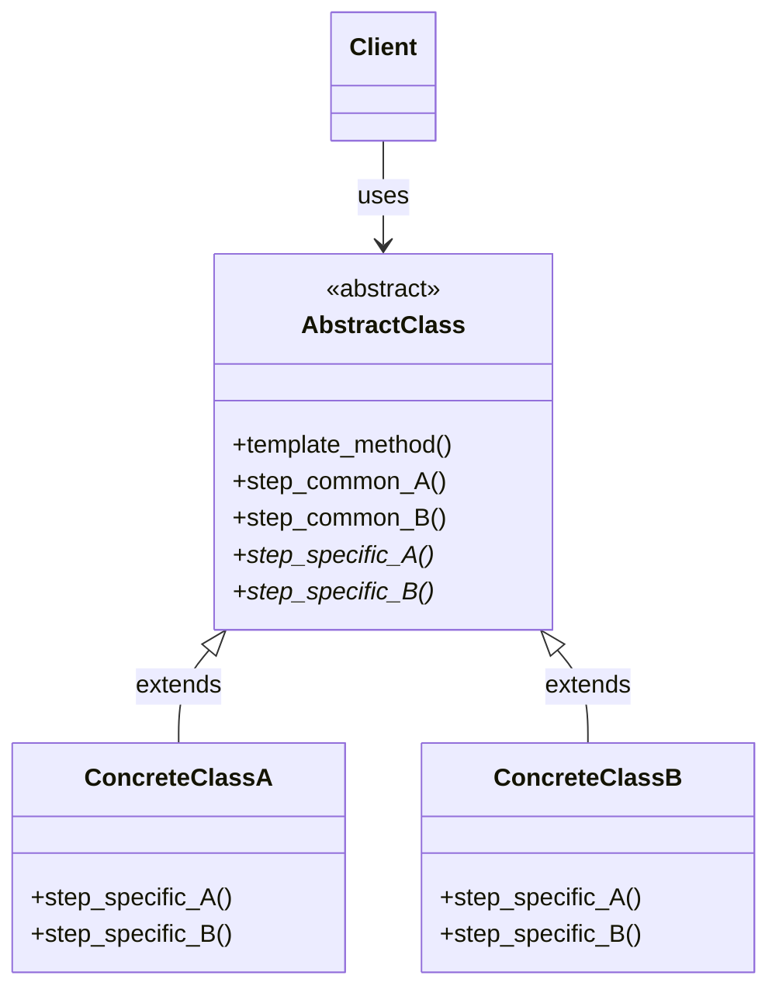
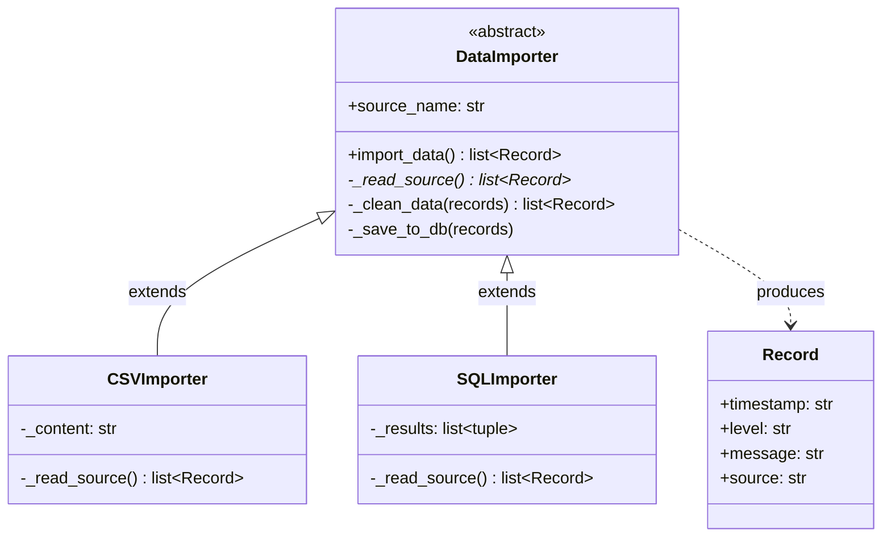
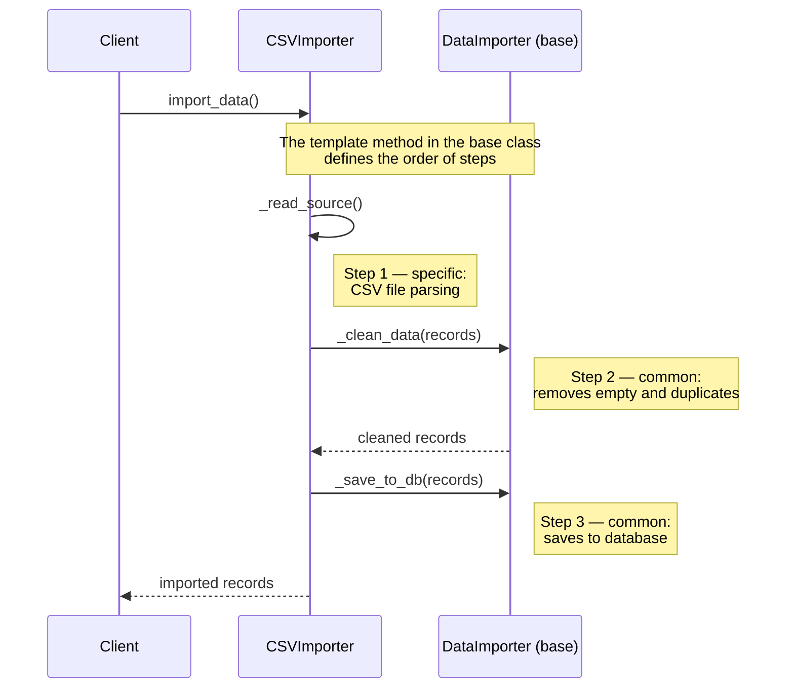

# Template Method Pattern

## Problem

Imagine a situation where we have a **series of algorithms** that share many common steps, but with some specific differences, especially in certain specific steps. Since they are different algorithms, what we do is implement each algorithm in a separate class, but this leads to **enormous code duplication**, with all the resulting problems: hard to maintain, extend, and test.

> **Analogy**: it's as if we had to write a recipe for pasta with tomato sauce, and then a recipe for pasta with pesto. The two recipes share many common steps (e.g., cook the pasta, drain, plate), but differ in some specific steps (e.g., prepare the tomato sauce or the pesto). If we write two separate recipes, we end up duplicating all the common steps, making everything hard to maintain and update (for example, if we want to change how we cook the pasta, we have to modify both recipes).

## Solution

The solution is the **Template Method** pattern: we create an **abstract class** that defines the general structure of the algorithm through a template method that calls the various steps in order. The common steps are implemented directly in the abstract class, while the specific steps are left as abstract methods to be implemented in the concrete classes. This way we avoid code duplication and make the system more flexible and easy to extend.

The three actors:

1. **`AbstractClass`**: defines the `template_method()` that calls the steps in order. The common steps are implemented here; the specific steps are declared as abstract methods (`step_A()`, `step_B()`).
2. **`ConcreteClass`**: extends `AbstractClass` and implements only the abstract methods, leaving the general structure intact.
3. **Client**: instantiates a `ConcreteClass` and calls the `template_method()`, which executes the complete algorithm delegating the specific steps to the subclass.

> **N.B.**: the template method is often `final` (or otherwise non-overridable), to ensure that the general structure of the algorithm remains intact and that specific steps are only redefined at the intended points.

> **Analogy**: the abstract class is the general recipe for making pasta, which defines the common steps (cook the pasta, drain, plate) and leaves the specific steps (prepare the sauce) as abstract methods. The concrete classes are the specific recipes for tomato pasta and pesto pasta: they implement the sauce, but inherit the general structure from the abstract class.

## Diagrams

### Generic Diagram

### Specific Diagram — Data Import Pipeline

### Sequence Diagram

### Advantages

- **Elimination of duplication (DRY)**: the common code is written once in the superclass, drastically reducing bugs from copy-paste.
- **Inversion of control (Hollywood Principle)**: the `template_method()` centrally manages the flow. Subclasses don't need to worry about *when* to execute each step — they only need to define *how* to execute their own.
- **Process standardization**: ensures that certain critical steps are always executed (e.g., opening/closing connections, logging), regardless of the subclass.
- **Ease of maintenance**: changing the order of algorithm steps is done in a single place in the base class and all subclasses automatically update.

### Disadvantages

- **Inheritance rigidity**: unlike Strategy, the Template Method is tied to single inheritance. If the class already extends something else, the pattern is not applicable. Moreover, the structure is fixed at compile-time: steps cannot be changed at runtime.
- **Risk of Liskov Substitution Principle (LSP) violation**: if the base class imposes abstract methods that some subclasses don't use, the developer is forced to leave them empty or throw `NotImplementedException` — a sign of fragile design.
- **Fragile Base Class**: modifying the base class can have unexpected side effects on all subclasses. The larger the hierarchy, the harder it is to predict what will change.
- **Customization limits**: the client is constrained to the "hooks" provided in the abstract class. If the order of two steps needed to be changed, the entire `template_method()` would need to be rewritten, negating the pattern's advantage.

