# Template Method Pattern

## 🎯 Problema

Ipotizziamo di trovarci in una situazione in cui abbiamo una **serie di algoritmi** che condividono tanti passaggi in comune, ma con alcune differenze specifiche, soprattutto in alcuni step specifici. Essendo algoritmi diversi quel che facciamo è andare a implementare ogni algoritmo in una classe diversa, ma questo porta a una **duplicazione di codice** enorme, con tutti i problemi che ne conseguono: difficile da mantenere, estendere e testare.

> **Analogia**: è come se dovessimo scrivere una ricetta per fare la pasta al pomodoro, e poi una ricetta per fare la pasta al pesto. Le due ricette condividono tanti passaggi in comune (es. cuocere la pasta, scolare, impiattare), ma differiscono in alcuni passaggi specifici (es. preparare il sugo al pomodoro o al pesto). Se scriviamo due ricette separate, finiamo per duplicare tutti i passaggi comuni, rendendo il tutto difficile da mantenere e da aggiornare (ad esempio se vogliamo cambiare il modo in cui cuociamo la pasta, dobbiamo modificare entrambe le ricette).

## ✅ Soluzione

La soluzione è il pattern **Template Method**: si crea una **classe astratta** che definisce la struttura generale dell'algoritmo tramite un metodo template che chiama i vari passaggi in ordine. I passaggi comuni vengono implementati direttamente nella classe astratta, mentre i passaggi specifici vengono lasciati come metodi astratti da implementare nelle classi concrete. In questo modo si evita la duplicazione di codice e si rende il sistema più flessibile e facile da estendere.

I tre attori:

1. **`AbstractClass`**: definisce il `template_method()` che chiama i passaggi in ordine. I passaggi comuni sono implementati qui; i passaggi specifici sono dichiarati come metodi astratti (`step_A()`, `step_B()`).
2. **`ConcreteClass`**: estende `AbstractClass` e implementa solo i metodi astratti, lasciando intatta la struttura generale.
3. **Client**: istanzia una `ConcreteClass` e chiama il `template_method()`, che esegue l'algoritmo completo delegando i passi specifici alla sottoclasse.

> **N.B.**: il metodo template è spesso `final` (o comunque non sovrascrivibile), per garantire che la struttura generale dell'algoritmo rimanga intatta e che i passaggi specifici vengano ridefiniti solo nei punti previsti.

> **Analogia**: la classe astratta è la ricetta generale per fare la pasta, che definisce i passaggi comuni (cuocere la pasta, scolare, impiattare) e lascia i passaggi specifici (preparare il condimento) come metodi astratti. Le classi concrete sono le ricette specifiche per la pasta al pomodoro e la pasta al pesto: implementano il sugo, ma ereditano la struttura generale dalla classe astratta.

## 📊 Diagramma

### Diagramma generico

### Diagramma specifico — Pipeline di Importazione Dati

### Diagramma di sequenza — Importazione da CSV

```mermaid
sequenceDiagram
    participant Client
    participant CSV as CSVImporter
    participant Base as ImportatoreDati (base)

    Client->>CSV: importa()
    Note over CSV,Base: Il template method nella classe base<br/>definisce l'ordine degli step

    CSV->>CSV: _leggi_sorgente()
    Note right of CSV: Step 1 — specifico:<br/>parsing del file CSV

    CSV->>Base: _pulisci_dati(records)
    Note right of Base: Step 2 — comune:<br/>rimuove vuoti e duplicati
    Base-->>CSV: records puliti

    CSV->>Base: _salva_nel_db(records)
    Note right of Base: Step 3 — comune:<br/>salva nel database

    CSV-->>Client: records importati
```

### Vantaggi

- **Eliminazione della duplicazione (DRY)**: il codice comune si scrive una volta sola nella superclasse, riducendo drasticamente i bug derivanti dal copia-incolla.
- **Inversione del controllo (Hollywood Principle)**: il `template_method()` gestisce centralmente il flusso. Le sottoclassi non devono preoccuparsi di *quando* eseguire ogni passo — devono solo definire *come* eseguire i propri.
- **Standardizzazione dei processi**: garantisce che certi passaggi critici vengano sempre eseguiti (es. apertura/chiusura connessione, logging), indipendentemente dalla sottoclasse.
- **Facilità di manutenzione**: cambiare l'ordine dei passi dell'algoritmo si fa in un unico punto nella classe base e tutte le sottoclassi si aggiornano automaticamente.

### Svantaggi

- **Rigidità dell'ereditarietà**: a differenza dello Strategy, il Template Method è legato all'ereditarietà singola. Se la classe estende già qualcos'altro, il pattern non è applicabile. Inoltre la struttura è fissa a compile-time: non si possono cambiare i passi a runtime.
- **Rischio di violazione del Liskov Substitution Principle (LSP)**: se la classe base impone metodi astratti che alcune sottoclassi non usano, lo sviluppatore è costretto a lasciarli vuoti o a lanciare `NotImplementedException` — segnale di un design fragile.
- **Fragile Base Class**: modificare la classe base può avere effetti collaterali inaspettati su tutte le sottoclassi. Più grande è la gerarchia, più è difficile prevedere cosa cambierà.
- **Limiti alla personalizzazione**: il client è vincolato ai "buchi" previsti nella classe astratta. Se servisse cambiare l'ordine di due passi, bisognerebbe riscrivere l'intero `template_method()`, annullando il vantaggio del pattern.

